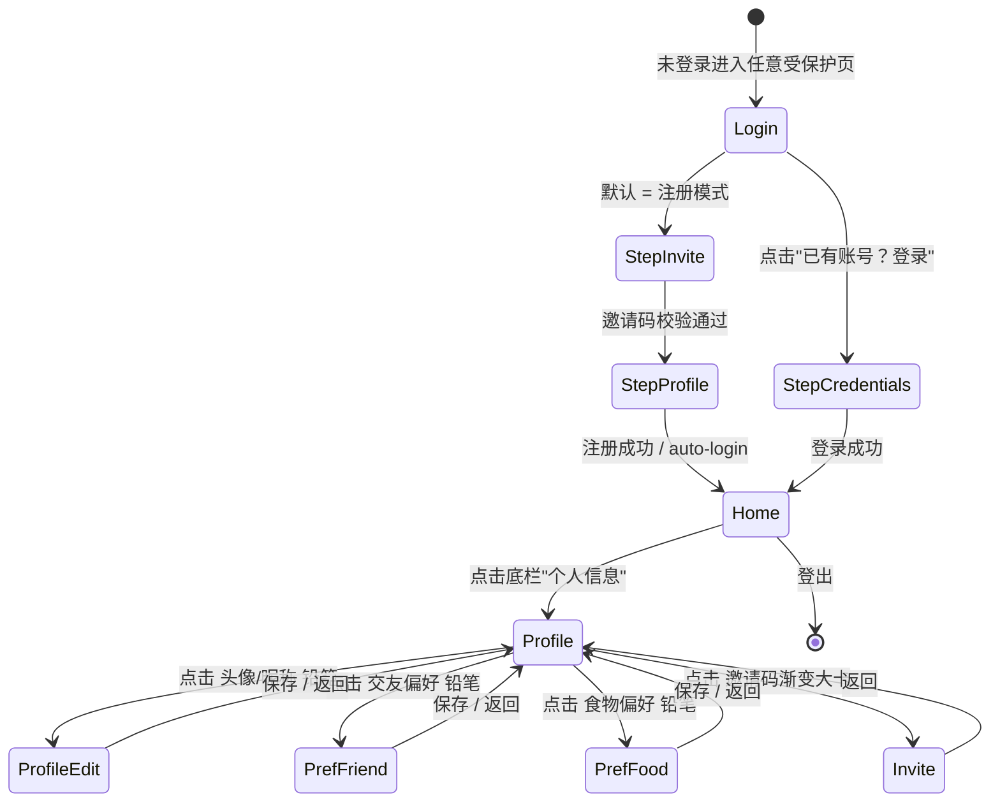

# Module A · 用户 / 认证 · Design Spec

> 日期：2026-04-20  |  作者：A+C 板块维护会话
> 本 spec **仅覆盖前端 6 个页面的交互与视觉设计**；所有 DB schema / API 端点 / zod schema / 邀请码算法 / JWT 流程 / 徽章 seed 均已在 `TEAM-CONTRACT.md §5` 锁定，此处只引用章节号。
>
> 视觉 token 全部来自 `docs/superpowers/specs/0-design-system.md`（下文简写为 DS）。禁止在本 spec 出现任何 hex 色值、px 数字 hardcode（页面左右 padding 除外），一律走 token 名。

---

## §1 范围与路由

本板块前端交付 6 个页面，按 Next.js App Router 分组：

| # | 路由 | Figma | 缺稿？ | 本 spec 章节 |
|---|---|---|---|---|
| 1 | `/(auth)/login` | frame-02 | 部分（第二步 Sheet 自创） | §4.1 |
| 2 | `/(protected)/profile` | frame-04 | 否 | §4.2 |
| 3 | `/(protected)/profile/edit` | — | **自创** | §4.3 |
| 4 | `/(protected)/preferences/friend` | — | **自创** | §4.4 |
| 5 | `/(protected)/preferences/food` | — | **自创** | §4.5 |
| 6 | `/(protected)/invite` | — | **自创** | §4.6 |

> 路由说明：Figma frame-02 的登录弹层叠在冰箱首页之上；我们实现为 `/(auth)/login` 独立页（后端未登录态守卫直接 307 到这里）。`register` 不单独成页——注册流走 `/login` 内的 Sheet（见 §4.1）。这里和 TEAM-CONTRACT §2 的目录约定**相容**：`apps/web/src/app/(auth)/register/page.tsx` 暂**不实现**，空占位或删除（KISS）。

---

## §2 导航流

### §2.1 文字描述

- 未登录用户访问任何 `/(protected)/**` → 由 `(protected)/layout.tsx` 的 `useMe` 返 401 触发 `redirect('/login')`。
- `/login` 内两步 Sheet：(1) 邀请码 → (2) 邮箱 + 密码 + 昵称 → 注册成功 → `/`（B 的首页）。
- 已有账号：`/login` 的 Sheet 顶部"已有账号？登录"切换为邮箱 + 密码单步 → `/`。
- 登录态下：底栏左"个人信息"→ `/profile`；`/profile` 的四块卡片右上角小铅笔图标分别下钻 `/profile/edit`、`/preferences/friend`、`/preferences/food`；邀请码大卡整卡可点 → `/invite`。
- 底栏固定三件套见 DS §7.3（左：profile / 中：起锅 / 右：活动列表）。
- A 板块落点：登录成功后默认去 `/`（冰箱首页由 B 实现）；若 B 未就绪，保底落 `/profile`（由 `(protected)/layout.tsx` 检测首页 404 时兜底，见 §9 "Walking Skeleton 保底"）。

### §2.2 mermaid 图



---

## §3 信息架构（L0-L3 审计 · 应用 frontend-logic-design 模型）

### §3.1 L0-L3 定义（本项目适配）

- **L0 概览**：不可编辑的全局入口，用户一眼看到自己是谁、当前状态。
- **L1 分组**：按主题聚类（个人信息 / 交友 / 食物 / 邀请码），只读。
- **L2 管理**：编辑态，单一主题，表单 + 保存。
- **L3 明细**：单条数据的详情（本板块无此层级）。

### §3.2 一致性矩阵

| 页面 | 层级 | 目的 | 主要操作 | 下钻入口 |
|---|---|---|---|---|
| `/profile` | **L0+L1** | 展示全部用户数据（L0 头像/昵称/城市）+ 四个 L1 只读分组 | 只读浏览 | 每组铅笔 → L2；邀请码卡整卡 → L2 |
| `/profile/edit` | L2 | 编辑 L1 "个人信息"组 | 表单 + 保存 + 返回 | — |
| `/preferences/friend` | L2 | 编辑 L1 "交友偏好"组 | 表单 + 保存 + 返回 | — |
| `/preferences/food` | L2 | 编辑 L1 "食物偏好"组 | 表单 + 保存 + 返回 | — |
| `/invite` | L2 | 编辑"邀请码"组：复制 + 分享 + 查看已邀名单 | 复制 + 分享 + 只读列表 | — |
| `/login` | 前台门禁 | 不属于 L0-L3，进入系统前的守卫 | 表单 | — |

**一致性校验**：
- L2 页面**视觉卡片结构必须与 L1 的只读 section 对齐**，即 `/profile/edit` 的卡片圆角、间距、标题位置 ≡ `/profile` 里"个人信息" section 的位置——用户下钻感知到"同一个东西被打开了"而非跳到陌生页面。
- L1 每个 section 有且仅有一个下钻入口（铅笔或整卡），避免"两个按钮都能进编辑页"造成决策分歧。
- 返回 L0 从任一 L2 都统一为顶部返回 + 左滑 gesture，保存后 toast + 自动返回；未保存有二次确认。

### §3.3 渐进式披露

`/profile` 是单页聚合（4 个卡片堆叠），**不做二级页用于只读明细**。编辑才进 L2。这是符合 Shneiderman 的"overview first, zoom and filter, details on demand"——demand 仅发生于要修改时。

---

## §4 页面逐一详述

> 约定：每节统一以 **视觉描述 → 组件拆解 → 状态机 / 数据流 → 错误/空/加载三态 → Playwright 验收** 推进。

### §4.1 登录 / 注册（frame-02）

#### 视觉描述

参考 `figma_exports/frame-02.png`：冰箱首页（frame-01 的模糊降透明版）为背景；中央居中 Sheet（非底部贴边），`rounded-2xl`、`bg-neutral-0`、`shadow-lg`。Sheet 顶部冰块 emoji 🧊 + `text-h2` 标题 "打开你的冰箱"；副标 `text-body-sm neutral-500` "输入邀请码，注册账号，加入邻食"；输入框 `rounded-md bg-neutral-100`；`danger.100` 背景的提示 chip "每人限量 3 个邀请名额"；主 CTA 渐变长条 `gradient-cta` + `shadow-glow-primary`，`text-button` 白字 "进入冰箱 →"；底部 `text-caption neutral-500` "还没有邀请码？联系已有用户获取"。

#### 组件拆解

- `LoginModal`（`components/auth/login-modal.tsx`）—— 根组件，内部用 `Sheet` / `Dialog`（shadcn）+ `AnimatePresence` 包装两个 step。
- `<InviteCodeStep>` —— step 1：输入框 + 提示 chip + CTA。
- `<CredentialsStep>` —— step 2（注册模式）：邮箱 + 密码 + 昵称三输入框 + CTA "进入冰箱"。
- `<LoginCredentialsStep>` —— step 2（登录模式）：邮箱 + 密码 + CTA "登录"。
- `<ModeToggle>` —— Sheet 顶部右上角 `text-caption` 文字按钮，切换"没账号？注册"⇄ "已有账号？登录"。
- 背景：`<FridgeBlurredBackdrop>` —— 半透明遮罩 + backdrop-blur，点击遮罩**不**关闭（因为没有其他入口）。

#### 状态机（两步 Sheet + 两模式）

```
mode: 'register' | 'login'
step (仅 register): 'invite' | 'credentials'

default: mode='register', step='invite'

register · invite → credentials:
  用户输入 inviteCode (模式 "LINSH-XXXX") → blur/submit
  前端 zod 校验 length===10 + 前缀 === 'LINSH-'
  不调后端（后端校验放在最终 POST /auth/register 一并做，避免多一次探测接口）
  通过则 setStep('credentials')，inviteCode 保留在 form state

register · credentials:
  用户填 email / password / nickname
  CTA 点击 → POST /auth/register { email, password, nickname, inviteCode }
  成功 → setTokens + redirect('/')
  失败错误码见下

login · 单步:
  用户填 email / password
  POST /auth/login → setTokens + redirect('/')
```

模式切换（ModeToggle 点击）：
- register → login：`step=undefined`，清空除 email 外的字段
- login → register：`step='invite'`，清空所有字段

#### 第二步 Sheet 自创设计（视觉）

因 Figma 未画，此处按 DS 原则补：
- **复用 Sheet 外壳**（同一 `rounded-2xl` 卡，同样尺寸），只替换内容区以减少跳动感——使用 Framer Motion `layout` prop 让高度平滑过渡 280ms。
- **顶部**：`←` 图标（`lucide:arrow-left`，`space-1` 和标题间隔）+ "填写账号信息" `text-h3`，返回步骤 1。
- **表单**：三输入框顺序 `email` → `password`（带"显示/隐藏"图标按钮）→ `nickname`（20 字计数器右对齐，`text-caption neutral-400`）。输入框样式与 step 1 一致（`rounded-md bg-neutral-100 space-y-3`）。
- **CTA**：同 step 1 "进入冰箱 →"；禁用态 `neutral-200 text-neutral-400`。
- **错误区域**：每字段下方 `text-caption danger.500`；整体错（邀请码已消费）在 CTA 上方 `danger.100` chip。

#### 数据流

- `react-hook-form` + `zodResolver(RegisterRequestSchema)`（见 TEAM-CONTRACT §5.3）。
- `LoginRequestSchema` 同源（TEAM-CONTRACT §5.3）。
- 成功后：
  1. `setTokens(tokens)`（`lib/auth.ts`，见 §12 对存储位置的决定）。
  2. `queryClient.invalidateQueries({ queryKey: ['me'] })` 触发 `useMe()` 重新拉取。
  3. `router.replace('/')`。

#### 错误态文案（错误码来自 TEAM-CONTRACT §5.4）

| 错误码 | 用户看到 |
|---|---|
| `INVITE_INVALID` | "邀请码无效，确认拼写是否正确" |
| `INVITE_CONSUMED` | "这张邀请码已用完 3 次名额啦" |
| `AUTH_EMAIL_TAKEN` | "这个邮箱已经注册过，去登录？"（附切换按钮） |
| `AUTH_INVALID_CREDENTIALS` | "邮箱或密码不对" |
| `USER_NICKNAME_INVALID` | "昵称需 1-20 字，不含特殊字符" |
| 网络错误 | toast `"网络有点慢，再试一次"` |

#### 加载/空态

- CTA 点击后立刻 `<Loader2 className="animate-spin" />` 替换文字，按钮禁用。
- 无空态（必有表单）。

#### Playwright 验收

- **桌面 1440×900 + 移动 393×852 两视口都跑**。
- 打开 `/login` → 可见 Sheet，标题 "打开你的冰箱"。
- step 1：输入 `LINSH-7823` → CTA "进入冰箱" → Sheet 高度过渡到 step 2。
- step 2：填 `test-<rand>@lin-shi.dev` + `StrongPass1!` + `测试用户` → 点 CTA → 断言 `/` 路由 + localStorage 有 `accessToken`。
- 错误邀请码 `LINSH-XXXX` → step 2 提交时后端返 `INVITE_INVALID` → 错误 chip 可见。
- 切换到登录模式 → 填已注册账号 → 登录成功。
- 错误密码登录 → `AUTH_INVALID_CREDENTIALS` 错误 chip 可见，不跳转。
- console 0 red error。

---

### §4.2 `/profile` 个人信息综合展示（frame-04）

#### 视觉描述

参考 `figma_exports/frame-04.png`：页面背景 `neutral.50`；顶栏 `text-display` "邻食" 品牌 + 右上角铃铛图标（通知，属 E；本板块仅占位）。其下是头像卡 `rounded-lg bg-neutral-0 shadow-sm`，含圆形头像（`rounded-full`，粉色描边）、`text-h3` 昵称、`text-body-sm neutral-500` "上海 · 杨浦区"。**在头像卡下方增加徽章 row**（§3 决定加，见下）。接着是渐变大卡 `gradient-invite rounded-xl shadow-md`，内容详见 §4.6。往下依次三个 section 卡：**个人信息 / 交友偏好 / 食物偏好**，每卡顶部 `text-h3` 标题 + 右上角 `lucide:pencil` 图标（`neutral-400`）。每 section 内以 `grid grid-cols-[1fr_auto]` 两列排 `label: value` 对。页面底部固定 CTA "编辑资料" `rounded-lg gradient-warm`（整体对应 L1 → L2 的替代入口，冗余不浪费但不违背 §3 铅笔原则——因为此 CTA 进 `/profile/edit` 而非偏好页）。

#### 组件拆解

- `<ProfileHeader>` —— 头像 + 昵称 + 城市。
- `<BadgeRow>` —— 徽章 chip 水平滚动条，每个 `<FridgeStickerBadge>`（DS §8.2）。未获得徽章不展示；空数组时整 row 隐藏。
- `<InviteCodeCard>` —— 渐变大卡（详见 §4.6 组件拆解，复用）。
- `<ProfileSection>` —— 通用容器：`props = { title, icon, onEditClick, children }`。子组件复用三次。
- `<ProfileBasicInfo>` —— 展示 `school`, `bio`（labels: "学校" / "一句话"）。
- `<FriendPrefDisplay>` —— 展示 `acceptStrangers`（"接受" / "不接受"）、`distanceKm`（"3km 以内"）、`timeSlots`（`<Chip>` 组 "工作日晚上"、"周末全天"——要做时间槽到可读文案的**客户端映射**，见下）。
- `<FoodPrefDisplay>` —— 展示 `cuisines`（chip 组）、`dietaryRestrictions`（chip 组或 "无特殊限制"）、`cookingSkill`（枚举到中文映射）。
- `<EditResumeButton>` —— 底部 CTA，点击跳 `/profile/edit`。

#### 徽章 row 加入决定

**决定：加**。放在头像卡下方、邀请码卡之上。
- 原因：PRD 明确"冰箱贴"是产品亮点；frame-13 的柴桥子弹窗已验证该行的视觉语言；`/profile` 是自己看自己，L0 层级应展示"我获得了什么"，避免用户只能在别人的弹层里见到冰箱贴。
- 尺寸：单个徽章 chip `48×48` `rounded-md`，内 `lucide` 图标（或徽章 svg）+ 底部 `text-chip` 标签；徽章之间 `space-2`；整 row 横向滚动避免截断。
- 动画：首次进入 `/profile`，徽章 stagger 50ms（DS §6.2 `fadeInUp`）。
- 空态：用户零徽章 → row 隐藏。MVP 阶段徽章颁发尚未实现（TEAM-CONTRACT §5.7 指出 MVP 由 F 或后续任务触发），所以多数用户此 row 为空是正常。

#### 数据流

- 主查询：`useMe()`（TEAM-CONTRACT §9.2）→ `UserPrivateSchema` 包含 `badges[]`。
- 偏好查询：`useQuery(['preferences','friend'], GET /me/preferences/friend)` 和 `['preferences','food']`。
- 邀请码查询：`useQuery(['invite-code'], GET /me/invite-code)`。
- 徽章定义：`useQuery(['badges','definitions'], GET /badges)` 一次性，`staleTime: Infinity`（不会变）。
- **积分（frame-04 "128 积分"）**：见 §12 风险条。本 spec 决定**走 F 的 credit score** 并在 UI 上把 "积分" 文案改为 **"信用 128"**（数值 `credit.score`）。积分单位不变（纯数字），F 未就绪时占位 "--"。这是**提案，待用户拍板**。
- 枚举 → 中文映射：在 `apps/web/src/lib/i18n/enums.ts`（新建文件）集中：

```ts
export const cuisineLabel: Record<Cuisine, string> = {
  SICHUAN: '川菜', CANTONESE: '粤菜', JIANGSU: '江浙菜', /* ... */,
};
export const cookingSkillLabel: Record<CookingSkill, string> = {
  BEGINNER: '新手', INTERMEDIATE: '家常水平', ADVANCED: '进阶', EXPERT: '专家',
};
// timeSlots → preset label：优先识别 6 个 preset（见 §4.4 TimePresets），不匹配则 fallback "X 条自定义时段"
```

#### 错误/空/加载三态

- 加载：四个卡片全骨架屏（`<Skeleton>` from shadcn），徽章 row 也骨架。
- 偏好未填（新用户）：卡片内显示 `text-body-sm neutral-400` "还没设置，点铅笔去填"。
- `useMe` 报错（非 401，401 已被 api client hooks 拦截）：全页错误卡"出问题啦 😥" + 重试按钮。

#### Playwright 验收

- 登录 → 访问 `/profile`。
- 断言 4 个卡片标题可见：`个人信息`、`交友偏好`、`食物偏好`，邀请码大卡含 `LINSH-` 前缀的字符串。
- 点击 个人信息 卡的铅笔 → `/profile/edit`。
- 点击 交友偏好 的铅笔 → `/preferences/friend`。
- 点击 食物偏好 的铅笔 → `/preferences/food`。
- 点击 邀请码大卡 → `/invite`。
- 徽章 row：新用户 badges=[] 时 row 不存在；mock 注入 `['taste_master']` 时可见一个 chip "口味达人"。
- 桌面 + 移动 两 viewport。

---

### §4.3 `/profile/edit` 编辑个人信息（自创）

#### 视觉描述（自创，遵守 DS）

页面顶部 `text-h1` "编辑资料" + `lucide:arrow-left` 返回；下方单卡 `rounded-lg bg-neutral-0 shadow-sm space-4`，包含：
- **头像区**：圆形头像 `rounded-full` `w-24 h-24`，右下角叠 `lucide:camera` 小圆按钮（`rounded-full gradient-cta shadow-sm`），点击触发文件选择；上传中心显 `Loader2 animate-spin` 蒙版。
- **表单字段**（顺序）：昵称 / 学校 / 城市 / 一句话介绍；每字段 `<Label text-label>` + `<Input rounded-md bg-neutral-100>`；bio 为 `<Textarea>` 3 行 + 右下角 `140` 字计数。
- **底部 sticky CTA**：`rounded-lg` 全宽 `gradient-cta`；未改动时 `disabled` 用 `neutral-200 text-neutral-400` 扁平样式（没有 glow）；改动过即亮起 `shadow-glow-primary`。
- 所有 spacing 用 DS `space-4` 内 padding，字段间 `space-3`。

#### 组件拆解

- `<AvatarUploader>` —— 内部 state：`preview (blob url) | url | null`；提交走 `POST /me/avatar` multipart；成功更新 `me` 的 `avatarUrl`。
- `<ProfileEditForm>` —— `react-hook-form` + `zodResolver(UpdateProfileRequestSchema)`，`defaultValues` 从 `useMe().data` 预填。
- `<UnsavedChangesGuard>` —— 监听 `form.formState.isDirty`，返回时 `window.confirm("未保存的修改会丢失")`。
- `<StickyPrimaryButton>` —— 带禁用态管理，loading 时显示 `Loader2 + "保存中…"`。

#### 状态机 / 数据流

```
onMount: form.reset(useMe().data 的相关字段子集)
onChange: isDirty = form.formState.isDirty
onSubmit:
  头像单独上传：若 avatarBlob 非空 → POST /me/avatar (multipart) → 得 { avatarUrl }
  然后 PATCH /me with { nickname?, school?, city?, bio?, avatarUrl? }
  成功：queryClient.setQueryData(['me'], newUser) + toast "已保存" + router.back()
  失败：保留表单值，字段错误 → form.setError；全局错误 → toast
onBackNav (系统返回 / 点返回按钮): if isDirty → confirm
```

#### 校验规则（zod 已定义 in TEAM-CONTRACT §5.3 `UpdateProfileRequestSchema`）

- `nickname` 1-20 字
- `school` ≤100 字可空
- `city` ≤50 字可空
- `bio` ≤140 字可空

时机：blur 即校验；字段下方 `text-caption danger.500`。

#### 头像上传规格

**MVP 决定**（待用户拍板，见 §12）：
- 格式白名单：`image/jpeg`、`image/png`、`image/webp`
- 前端文件大小 ≤ 2MB（超限立即 toast "图片不能超过 2MB"，不上传）
- 后端最终以 `USER_AVATAR_TOO_LARGE`、`USER_AVATAR_BAD_FORMAT` 为权威。
- 不做裁剪框 MVP 省事，直接上传原图（后端可以 sharp 压缩到 512×512 webp，但不阻塞前端）。
- 预览：`URL.createObjectURL(file)` 直接显示，上传成功后替换为 `avatarUrl`。

#### 错误/加载三态

- 加载：页面进入时 `useMe` pending 则骨架屏表单。
- 错误：整页错 → "加载资料失败 重试"按钮；字段错 → 就地红字。
- 空态：不存在（编辑页必有数据）。

#### Playwright 验收

- 登录 → 从 `/profile` 铅笔 → `/profile/edit`。
- 断言表单预填：`input[name=nickname]` 的值 === `useMe().nickname`。
- 清空 nickname → blur → "昵称需 1-20 字" 错误可见，CTA 不亮。
- 改 nickname 为 `"新昵称"` → CTA 亮起。
- 点击返回按钮 → dialog confirm "未保存的修改会丢失" 出现（取消则留在页面）。
- 点击 CTA 保存 → toast "已保存" 出现 → 自动返回 `/profile` → 可见新昵称。
- 上传 4MB 图片 → toast "图片不能超过 2MB"，未触发网络请求。
- 上传 500KB WebP → 预览立即更新 → 保存 → 回 `/profile` 看到新头像。
- 桌面 + 移动 两 viewport。

---

### §4.4 `/preferences/friend` 编辑交友偏好（自创）

#### 视觉描述

顶部 `text-h1` "交友偏好" + 返回；下分三张卡，每卡 `rounded-lg bg-neutral-0 shadow-sm`：

1. **接受陌生人** —— 左侧 `text-label` 标题 + 右侧 shadcn `<Switch>`（自定义激活色 `brand.primary.500`）。下方 `text-caption neutral-500` 副文 "关闭后，只有熟人扩展的活动会匹配到你"。
2. **距离范围** —— 标题 + 当前值 `text-h3 brand.primary.600` "3km 以内"（tabular-nums）；下方 shadcn `<Slider>` 1-50，步长 1，轨道色 `neutral-200`，已选段 `gradient-cta`，thumb `rounded-full brand.primary.500 shadow-md`。
3. **时间偏好** —— 提供 **6 个 preset chip** 多选：`工作日早上`、`工作日午间`、`工作日晚上`、`周末早上`、`周末午间`、`周末晚上`。Chip 未选：`neutral-100 text-neutral-700 rounded-sm`；选中：`brand.primary.100 text-brand.primary.700 border brand.primary.400`。下方 `text-caption neutral-500` "选中的时段会用于匹配推荐，可多选"。MVP 不提供自定义矩阵（防止设计/实现复杂度爆炸）。

底部 sticky CTA "保存"。

#### 组件拆解

- `<FriendPrefForm>` —— `react-hook-form` + `zodResolver(FriendPreferencesSchema)`。
- `<AcceptStrangersSwitch>`
- `<DistanceSlider>` —— 受控 `<Slider value={[distanceKm]} onValueChange={([v]) => field.onChange(v)} />`
- `<TimeSlotsSelector>` —— 内部把 6 个 preset ↔ `TimeSlot[]`（每 preset 对应一组 `{dayOfWeek, startHour, endHour}` 数组）。映射表：

```ts
export const TIME_PRESETS: Record<string, TimeSlot[]> = {
  WEEKDAY_MORNING: daysMonFri.map(d => ({ dayOfWeek: d, startHour: 7, endHour: 10 })),
  WEEKDAY_NOON:    daysMonFri.map(d => ({ dayOfWeek: d, startHour: 11, endHour: 14 })),
  WEEKDAY_EVENING: daysMonFri.map(d => ({ dayOfWeek: d, startHour: 18, endHour: 22 })),
  WEEKEND_MORNING: [6, 7].map(d => ({ dayOfWeek: d, startHour: 8, endHour: 11 })),
  WEEKEND_NOON:    [6, 7].map(d => ({ dayOfWeek: d, startHour: 11, endHour: 14 })),
  WEEKEND_EVENING: [6, 7].map(d => ({ dayOfWeek: d, startHour: 18, endHour: 22 })),
};
// daysMonFri = [1,2,3,4,5]  (dayOfWeek 1=Mon,...,7=Sun per TEAM-CONTRACT §5.3)
```

**重要**：`/profile` 只读显示时（§4.2）做**逆映射**——若服务端返回的 `timeSlots[]` 和某 preset 严格相等则显示该 preset 名；否则 fallback "自定义 N 段"。

#### 数据流

```
onMount: GET /me/preferences/friend → form.reset
onSubmit: PUT /me/preferences/friend with full FriendPreferencesSchema payload
  body = { acceptStrangers, distanceKm, timeSlots: presets.flatMap(p => TIME_PRESETS[p]) }
成功 → queryClient.setQueryData(['preferences','friend'], body) + toast + router.back()
```

#### 错误/加载

- 加载：三卡骨架屏。
- 滑块滑到外围：zod 校验 `distanceKm` ∈ [1, 50]，越界 → `PREF_DISTANCE_OUT_OF_RANGE`（TEAM-CONTRACT §5.4），UI 上 Slider 组件本身限制，不会越界；防御性接后端错误 → toast。
- 空态：首次进入 acceptStrangers=false, distanceKm=5, timeSlots=[] 为后端默认值，直接显示。

#### Playwright 验收

- 进入 `/preferences/friend` → Switch、Slider、6 个 chip 可见。
- 默认 Switch off → 点击 → on；Slider 默认 5 → 拖到 10 → 显示 "10km 以内"。
- 点击 "工作日晚上" + "周末全天"（即"周末早/午/晚"全选 OR 仅周末晚上——取决于实际名称；本 spec 采用 6 preset 故要点两次：周末早+晚，或明确 UI label 仅"周末晚上" 对应后者）→ chip 变色。
- 点 "保存" → 断言 `PUT /me/preferences/friend` 请求发送，body 含 `acceptStrangers=true, distanceKm=10, timeSlots` 非空 → toast → 返回 `/profile` → 交友偏好 section 值已更新。
- 桌面 + 移动 两 viewport。

---

### §4.5 `/preferences/food` 编辑食物偏好（自创）

#### 视觉描述

三张卡（结构与 §4.4 对齐，一致性原则）：

1. **常吃菜系** —— 标题 + 副文 "最多选 10 个"；下方 chip grid 展示 `CuisineEnum` 全 20 项。chip 中英双语 label（"川菜 SICHUAN" 不需要；只显示中文，见 §4.2 enum 映射）。多选，选中达 10 个后其余 chip 变 `neutral-200 text-neutral-400 cursor-not-allowed`。
2. **饮食限制** —— 同样 chip 多选，`DietaryRestrictionEnum` 10 项（"素食"、"纯素"、"清真"、"犹太洁食"、"无麸质"、"无乳糖"、"无坚果"、"无海鲜"、"少辣"、"低钠"）。
3. **做饭水平** —— 单选 chip row，`CookingSkillEnum` 4 项（新手 / 家常水平 / 进阶 / 专家）；单选组态：选中 `gradient-cta text-neutral-0`，未选 `neutral-100 text-neutral-700`。

底部 sticky CTA "保存"。

#### 组件拆解

- `<FoodPrefForm>` —— `react-hook-form` + `zodResolver(FoodPreferencesSchema)`。
- `<MultiChipSelector<T extends string>>` —— 通用多选 chip；props `{ options, value, onChange, max, labelMap }`。
- `<SingleChipSelector<T extends string>>` —— 单选版本。
- 复用 `cuisineLabel`、`dietaryRestrictionLabel`、`cookingSkillLabel`（§4.2 enum 映射文件）。

#### 数据流

```
onMount: GET /me/preferences/food
onSubmit: PUT /me/preferences/food with FoodPreferencesSchema
  { cuisines: string[], dietaryRestrictions: string[], cookingSkill: 'BEGINNER' | ... }
```

#### 校验

- `cuisines.length ≤ 10`（UI 层禁止超选；zod 兜底）
- `dietaryRestrictions.length ≤ 10`
- `cookingSkill` 必填（默认值 `BEGINNER`）

#### Playwright 验收

- 进入 `/preferences/food` → 三卡可见。
- 点击 11 个菜系 → 第 11 个不响应，提示 "最多选 10 个"（toast 或 chip hover tooltip）。
- 点击 `家常菜`、`东南亚`、`日料` 对应 enum `CANTONESE` / `THAI` / `JAPANESE`（TEAM-CONTRACT §5.2 枚举命名）——注意 frame-04 显示的"家常菜"对应 enum **需映射**；MVP 决定：把 `CANTONESE` 的中文 label 改为 "粤菜"，"家常菜" 不映射到单一 enum（它本来就是口语化），前端 UI 使用官方 20 项全中文。**提示用户**：若需要"家常菜"作为独立 enum，后端 enum 表需扩展，建议另立话题（见 §12）。
- 做饭水平点 `家常水平` → 单选状态变更。
- 保存 → `PUT /me/preferences/food` 发送 → toast → 返回 `/profile` → 食物偏好 section 更新。
- 桌面 + 移动。

---

### §4.6 `/invite` 邀请码详情（自创）

#### 视觉描述

顶部 `text-h1` "我的邀请码" + 返回；主内容：

1. **渐变大卡**（复用 `/profile` 的 `<InviteCodeCard>`）—— `gradient-invite rounded-xl shadow-md space-4`；上方 `text-caption neutral.700` "我的邀请码"；中央 `text-display` 大字 `LINSH-7823`（`tabular-nums letter-spacing: 0.05em`），`font-weight: 700`，颜色 `neutral.900`；下方 `text-body-sm` "每人限额 3 次邀请 · 已用 N 次"；右侧白色药丸按钮"复制"（点击复制 + `navigator.share` 或 fallback，`text-button brand.primary.600`）。
2. **进度条** —— 大卡下方独立小条 `rounded-full bg-neutral-200 h-2`，已用宽度 `gradient-cta`（动画 `width 300ms ease-out`）。右侧 `text-caption neutral.500` "{N}/3"。
3. **已邀列表** —— `text-h3` 标题 "已经用这张码加入的朋友"；下方列表每行 `<Avatar rounded-full w-10 h-10>` + 昵称 `text-body` + 加入时间 `text-caption neutral.500 tabular-nums`。空态 emoji 🧊 + "还没有朋友用你的码加入，快分享吧"。
4. **底部 sticky CTA "分享给好友"** —— `gradient-cta shadow-glow-primary`，点击：
   - 若 `navigator.share` 可用：调系统 share sheet，`text = "用我的邀请码 LINSH-7823 加入邻食吧～"`。
   - 否则：`navigator.clipboard.writeText(...)` + toast "已复制分享链接"。

#### 组件拆解

- `<InviteCodeCard>` —— 复用（§4.2 也用）；props `{ code, maxUses, usesRemaining, compact?: boolean }`（`/profile` 的版本压缩、不显示进度条，本页 full 版本显示）。
- `<UseProgressBar>` —— `{ used: number, max: number }`。
- `<RedemptionsList>` —— 数据从 `GET /me/invite-code` 响应的 `redemptions[]` 渲染。
- `<ShareButton>` —— 处理 Web Share API + clipboard fallback。

#### 数据流

- `useQuery(['invite-code'], GET /me/invite-code)` → `{ code, maxUses, usesRemaining, redemptions: [{ userId, nickname, redeemedAt }] }`（响应 shape 详见 TEAM-CONTRACT §5.6）。
- 复制：`navigator.clipboard.writeText(code)` → toast "已复制"。
- 分享：见上。

#### 错误/加载/空态

- 加载：大卡骨架屏 + 列表 3 条占位。
- 列表空：显示 emoji 🧊 + 提示。
- 列表非空：按 `redeemedAt DESC` 排序。

#### Playwright 验收

- 从 `/profile` 点邀请码大卡 → 到 `/invite`。
- 断言大卡上 `LINSH-` 字符串 + 进度条。
- 点 "复制" → `navigator.clipboard.readText()` === code。
- 已用 1 次：列表含 1 行；已用 3 次：CTA 分享按钮禁用 + 文案改 "已达 3 次上限"。
- 点 CTA 分享：桌面 Chrome 无 Web Share API → 走剪贴板 + toast。
- 桌面 + 移动。

---

## §5 API 调用地图

引用 TEAM-CONTRACT §5.4 端点列表。下表列出**每页 ↔ 端点 ↔ React Query key** 的对应。

| 页面 | 端点 | Method | Query Key | Mutation? |
|---|---|---|---|---|
| `/login` step 1 | —（纯前端 zod）| — | — | — |
| `/login` step 2 注册 | `/auth/register` | POST | — | `useMutation` |
| `/login` 登录 | `/auth/login` | POST | — | `useMutation` |
| `(protected)/layout` | `/me` | GET | `['me']` | — |
| `/profile` | `/me` | GET | `['me']` | — |
| `/profile` | `/me/preferences/friend` | GET | `['preferences','friend']` | — |
| `/profile` | `/me/preferences/food` | GET | `['preferences','food']` | — |
| `/profile` | `/me/invite-code` | GET | `['invite-code']` | — |
| `/profile` | `/badges` | GET | `['badges','definitions']` `staleTime: Infinity` | — |
| `/profile` | `/me/badges` | GET | `['me','badges']` | — |
| `/profile` | `/credit/users/:id` (F) | GET | `['credit', userId]` | — （F 未就绪 mock） |
| `/profile/edit` | `/me/avatar` | POST (multipart) | — | `useMutation` |
| `/profile/edit` | `/me` | PATCH | — | `useMutation` → `setQueryData(['me'])` |
| `/preferences/friend` | `/me/preferences/friend` | PUT | — | `useMutation` → `setQueryData(['preferences','friend'])` |
| `/preferences/food` | `/me/preferences/food` | PUT | — | `useMutation` → `setQueryData(['preferences','food'])` |
| `/invite` | `/me/invite-code` | GET | `['invite-code']` | — |
| global logout | `/auth/logout` | POST | invalidate all | `useMutation` |

**全局**：成功 mutation 后用 `queryClient.setQueryData` 而非 `invalidateQueries` 减少一次 GET（除非响应不含完整数据）。

---

## §6 表单处理规范

- **库**：`react-hook-form@^7.53` + `@hookform/resolvers/zod`。
- **schema 源**：`@lin-shi/contracts`，本板块用 `RegisterRequestSchema`、`LoginRequestSchema`、`UpdateProfileRequestSchema`、`FriendPreferencesSchema`、`FoodPreferencesSchema`（全部在 TEAM-CONTRACT §5.3 定义）。
- **校验时机**：`mode: 'onBlur'`，`reValidateMode: 'onChange'`（首次 blur 后即时跟进）。
- **错误展示**：字段下方 `text-caption danger.500`；整体错（后端返回）在 CTA 上方 `danger.100 rounded-sm p-3` chip。
- **提交**：CTA 变 `<Loader2 className="animate-spin" /> + "保存中…"`，按钮 `disabled`；其他交互通过 `<fieldset disabled={isSubmitting}>` 禁用。
- **成功反馈**：`<Toaster>`（shadcn）`success` 变体 "已保存"，自动 `router.back()` 延迟 200ms（让用户看到 toast 再返回）。
- **`defaultValues` 必须预填**（编辑页），用 `form.reset(data)` 在 `useEffect` 里 data 到达时重置。

---

## §7 Animations 关键点

基于 DS §6 tokens：

| 场景 | 参数 | 组件/实现 |
|---|---|---|
| 登录 modal 出现 | 遮罩 `opacity 0→1` 200ms + Sheet `y: 40 → 0` 280ms `cubic-bezier(0.32,0.72,0,1)` | `<Dialog>` with `motion.div` |
| Sheet 两步切换 | `motion.div layout transition={duration:0.28}` + step A fade-out 180 + step B fade-in 280 | `<AnimatePresence mode="wait">` |
| 页面进出 | 右滑进 280ms，左滑返 280ms（App Router 路由级 Framer Motion） | `apps/web/src/components/motion/page-transition.tsx` |
| 徽章 row 首次展示 | `staggerChildren: 0.05`, 每 chip `y:12 → 0 + opacity 0 → 1` 200ms | `<BadgeRow>` 内 `motion.div` |
| CTA 点击反馈 | `scale 1 → 0.96` 150ms `scalePressIn` preset | DS §6.2 |
| Slider 拖动当前值变化 | 数字 `spring {stiffness:220, damping:22}` | Slider 组件 |
| 邀请码进度条填充 | `width` 300ms ease-out | `<UseProgressBar>` |
| 头像上传 loader 蒙版 | opacity 150ms | `<AvatarUploader>` |

所有动画尊重 `prefers-reduced-motion: reduce`（DS §6.3）—— 降级为纯 opacity 150ms。

---

## §8 空 / 加载 / 错误三态

| 页面 | 空 | 加载 | 错误 |
|---|---|---|---|
| `/login` | — | CTA loader | 字段红字 + CTA 上方 chip |
| `/profile` | 偏好未填 → 卡内 "还没设置" | 四卡骨架 + 徽章 row 骨架 | 全页 `<ErrorCard>` + 重试 |
| `/profile/edit` | — | 表单骨架 | 字段红字 / 全页错卡 |
| `/preferences/friend` | —（总是有默认值） | 三卡骨架 | 同上 |
| `/preferences/food` | —（总是有默认值） | 三卡骨架 | 同上 |
| `/invite` | 列表 0 条 → emoji + 提示 | 大卡骨架 + 列表 3 条占位 | 整页错卡 |

通用错卡 `<ErrorCard>` 文案 "出问题啦 😥 稍后再试" + "重试" 按钮，参照 DS §10.3。

---

## §9 后端引用（不重写，仅引用）

| 主题 | 章节 |
|---|---|
| 数据模型（u_users / u_refresh_tokens / u_invite_codes / u_invite_redemptions / u_friend_preferences / u_food_preferences / u_badges / u_user_badges） | TEAM-CONTRACT §5.1 |
| 枚举（Cuisine / DietaryRestriction / CookingSkill） | TEAM-CONTRACT §5.2 |
| zod schema 骨架（Register/Login/Tokens/UserPublic/UserPrivate/UpdateProfile/FriendPref/FoodPref/InviteCode/Badge） | TEAM-CONTRACT §5.3 |
| API 端点表（15 条） | TEAM-CONTRACT §5.4 |
| 注册 / 登录 / 刷新 / Access 校验序列 | TEAM-CONTRACT §5.5 |
| 邀请码算法（格式 / 冲突重试 / 消费 / 唯一约束） | TEAM-CONTRACT §5.6 |
| 徽章 seed（4 条：口味达人 / 健康生活 / 热情房主 / 准时达人） | TEAM-CONTRACT §5.7 |
| JWT 基础设施（AuthGuard / CurrentUser decorator） | TEAM-CONTRACT §4.5 |
| 统一错误响应 / 分页 / 事件总线 | TEAM-CONTRACT §4.3 / 4.4 / 4.6 |

**zod schema 落地目录**（TEAM-CONTRACT §2 目录已定）：
```
packages/contracts/src/
  auth/
    register.ts          # RegisterRequestSchema, AuthTokensSchema
    login.ts             # LoginRequestSchema, RefreshRequestSchema
    jwt-payload.ts       # JwtPayloadSchema
    current-user.ts      # CurrentUserSchema
  users/
    user.ts              # UserPublicSchema, UserPrivateSchema
    update-profile.ts    # UpdateProfileRequestSchema
  preferences/
    friend-preferences.ts  # TimeSlotSchema, FriendPreferencesSchema
    food-preferences.ts    # FoodPreferencesSchema
  invite-codes/
    invite-code.ts       # InviteCodeSchema, RedemptionSchema
  badges/
    badge-definition.ts  # BadgeDefinitionSchema, UserBadgeSchema
```

---

## §10 实现顺序建议

按"契约 → 基础设施 → 纵向分板块 → 前端" 的顺序，每步可独立 MR。

### Phase 1: 契约
1. `packages/contracts/src/enums.ts` — Cuisine / DietaryRestriction / CookingSkill 枚举落地（§5.2）。
2. `packages/contracts/src/common/{error,pagination,id}.ts` — ApiError / Pagination helpers。
3. 按 §9 目录落 auth / users / preferences / invite-codes / badges 的 zod schema。
4. 全部 re-export 到 `packages/contracts/src/index.ts`。
5. `pnpm -r build` 通过。

### Phase 2: 后端基础设施
6. `apps/api/src/config/env.schema.ts`（TEAM-CONTRACT §4.1）+ `config.module.ts` + `typeorm.config.ts`。
7. `common/` 的 exceptions filter / logging interceptor / zod validation pipe。
8. `main.ts` 接入 Pino + Swagger + ZodValidationPipe 全局注册。

### Phase 3: A 后端模块（纵向，先简后复）
9. **AuthModule** —— 用户 + refresh_token 两张表的 entity + migration；`auth.controller.ts`（register/login/refresh/logout）+ `auth.service.ts` + `jwt.strategy.ts` + `jwt-auth.guard.ts` + `current-user.decorator.ts`。
10. **InviteCodesModule** —— `u_invite_codes` + `u_invite_redemptions` 的 entity + migration；生成算法（Crockford Base32 + 去易混字符）；`POST /auth/register` 消费流程。
11. **UsersModule** —— `/me` GET/PATCH + `/me/avatar`（用 `@nestjs/platform-express` 的 `FileInterceptor` + 本地 `uploads/` + ServeStatic）+ `/users/:id/public`。
12. **PreferencesModule** —— `u_friend_preferences` + `u_food_preferences` entity + migration；`/me/preferences/{friend,food}` GET/PUT。注意首次 GET 应 upsert 默认值后返回。
13. **BadgesModule** —— `u_badges` + `u_user_badges` entity + migration；seed 4 条徽章的 migration（§5.7）；`/badges` + `/me/badges`。

### Phase 4: 前端
14. `apps/web/src/lib/{env,api,auth}.ts` — ky client + JWT 注入 + refresh hook（TEAM-CONTRACT §9.1）。
15. `hooks/use-me.ts`（TEAM-CONTRACT §9.2）。
16. `providers/query-provider.tsx` + root `layout.tsx`。
17. `(auth)/login/page.tsx` + `LoginModal` + 两 step + 两模式（§4.1）。
18. `(protected)/layout.tsx` —— 守卫 + 底栏 `<BottomNav>`（DS §7.3）。
19. `(protected)/profile/page.tsx` —— 头像头 + 徽章 row + 邀请码大卡 + 三 section（§4.2）。
20. `(protected)/profile/edit/page.tsx` —— 头像上传 + 表单（§4.3）。
21. `(protected)/preferences/friend/page.tsx` —— 三卡 + preset chip（§4.4）。
22. `(protected)/preferences/food/page.tsx` —— 三卡多选/单选（§4.5）。
23. `(protected)/invite/page.tsx` —— 大卡 + 进度 + 列表 + share（§4.6）。
24. 全局 `<Toaster>` 挂 `layout.tsx`。

### Phase 5: 验收
25. simplify + pjr（lint + build + 逻辑点）
26. Playwright E2E 跑下面 §11 的 checklist，桌面 + 移动双 viewport。
27. git-merge-to-develop。

---

## §11 Playwright 验收清单（桌面 1440×900 / 移动 393×852，**两视口都跑**）

### §11.1 注册 / 登录流

- [ ] 访问 `/` 未登录 → 302 到 `/login`。
- [ ] `/login` 显示 Sheet，标题 "打开你的冰箱"，输入框 placeholder "请输入邀请码"。
- [ ] 输入 `LINSH-XXXX` 无效 → 不跳步骤（前端 length/前缀校验 OR 后端 `INVITE_INVALID` 显示）。
- [ ] 输入有效种子邀请码 → 进入 step 2，顶部 "填写账号信息" 可见。
- [ ] step 2 填合法 email + 8 字符密码 + 昵称 → CTA 亮起 + 点击 → `POST /auth/register` 200 → localStorage `accessToken` 存在 → 跳 `/`。
- [ ] 重复注册同 email → `AUTH_EMAIL_TAKEN` 错误 chip + "去登录？" 切换按钮生效。
- [ ] 切换到"已有账号？登录" → step=undefined，只显示 email + password。
- [ ] 错误密码登录 → `AUTH_INVALID_CREDENTIALS` chip。
- [ ] 正确密码登录 → 跳 `/`。

### §11.2 登出 & 刷新

- [ ] 登录后，从底栏或 profile 触发登出 → `POST /auth/logout` → localStorage 清空 → 跳 `/login`。
- [ ] 登录后模拟 access token 过期（改 localStorage.ts 的过期时间）→ 访问受保护页 → api client hook 自动走 `/auth/refresh` → 正常加载。
- [ ] 模拟 refresh token 也过期 → 跳 `/login` 清空 session。

### §11.3 Profile 综合展示

- [ ] 登录后访问 `/profile` → 头像 + 昵称 + 城市 + 四卡可见。
- [ ] 新用户 badges=[] → 徽章 row 不渲染。
- [ ] mock 注入 badges=['taste_master'] → 可见徽章 chip "口味达人"，图片加载成功（或 Lucide fallback）。
- [ ] 偏好未填 → 卡内显示 "还没设置"。
- [ ] 邀请码卡显示 `LINSH-` 前缀码 + "每人限额 3 次邀请 · 已用 N 次"。
- [ ] 四个下钻入口（三铅笔 + 邀请码整卡）分别跳 `/profile/edit`、`/preferences/friend`、`/preferences/food`、`/invite`。
- [ ] 底部 "编辑资料" CTA → `/profile/edit`。

### §11.4 Profile Edit

- [ ] 进入 `/profile/edit` → 表单预填。
- [ ] 空 nickname → 错误 "昵称需 1-20 字"。
- [ ] 改 nickname → CTA 亮起。
- [ ] 未保存点返回 → confirm 对话框。
- [ ] 保存成功 → toast + 回 `/profile` + 新值可见。
- [ ] 4MB 图片上传 → toast "图片不能超过 2MB"。
- [ ] 500KB WebP 上传 + 保存 → `/profile` 头像更新。

### §11.5 Friend Preferences

- [ ] 进入 `/preferences/friend` → 三卡可见（Switch / Slider / 6 chips）。
- [ ] Switch 切换 → 记录 dirty 状态。
- [ ] Slider 拖到 10 → 显示 "10km 以内"。
- [ ] 点 "工作日晚上" chip → 变色。
- [ ] 保存 → `PUT /me/preferences/friend` body 含 `acceptStrangers`、`distanceKm=10`、`timeSlots` 非空 → 回 `/profile` 看到映射回显。

### §11.6 Food Preferences

- [ ] 进入 `/preferences/food` → 三卡可见（20 菜系 chip / 10 限制 chip / 4 技能 chip）。
- [ ] 选 11 个菜系 → 第 11 个被禁（cursor-not-allowed + 提示）。
- [ ] 选 `川菜 / 日料 / 家常水平` → 保存 → 回 `/profile` 看到 `家常菜` chip（如果 family→CANTONESE 映射；否则相应）。
- [ ] 做饭水平单选生效（换选时前值取消）。

### §11.7 Invite 详情

- [ ] 进入 `/invite` → 大卡 + 进度 + 列表可见。
- [ ] 点 "复制" → `navigator.clipboard.readText()` === code。
- [ ] 列表 0 条 → emoji + 提示。
- [ ] 列表非空 → 按时间倒序。
- [ ] 点 "分享给好友" → Web Share API（移动真机）或 toast "已复制"（桌面 Chrome）。
- [ ] 已用 3 次 → 进度条满 + 分享 CTA 文案 "已达上限"。

### §11.8 通用

- [ ] 所有页面 console 0 red error。
- [ ] 所有网络请求 status 2xx（预期 4xx 除外）。
- [ ] `prefers-reduced-motion: reduce` 下动画降级为 opacity fade。
- [ ] 桌面 + 移动 两 viewport 均跑过。

---

## §12 风险 & 未定事项

### §12.1 已做提案，待用户拍板

| # | 事项 | 提案 | 备选 |
|---|---|---|---|
| 1 | frame-04 "128 积分" 的数据来源 | **显示 F 的 `credit.score`，把文案改 "信用 128"**（`UI label: 信用`）。MVP 期 F 未就绪时占位 "--"。 | A. 客户端 `credit × 某系数` 呈现"积分"； B. 新增 `GET /me/points` 端点扩展 A 作用域 |
| 2 | `/profile` 加徽章 row | **加**：头像卡下方横向 chip 滚动条，4 徽章 stagger fade-up | 不加，只在"别人冰箱"出现（frame-13 风格） |
| 3 | 头像上传规格 | **≤2MB，仅 JPEG/PNG/WebP，原图上传，后端压 512×512 webp** | 前端 1MB 限制 + 强制裁剪 |
| 4 | refresh token 存储 | **MVP 锁定 localStorage**（KISS） | 部署后改 httpOnly cookie（下一里程碑） |
| 5 | 时间偏好编辑态 UI | **6 个 preset chip**（工作日/周末 × 早/午/晚） | 星期 × 时段矩阵（灵活但复杂） |
| 6 | 第二步 Sheet 视觉风格 | **复用 frame-02 外壳，`motion layout` 高度平滑过渡** | 步骤条 + 多步 Wizard（重） |
| 7 | "家常菜" enum 映射 | **Cuisine enum 不扩展，frame-04 的"家常菜"实为口语化，改用 CuisineEnum 中文官方 label（"粤菜 / 川菜 / 东南亚 / 日料"）** | 扩展 enum 加 `HOME_STYLE`（需 DB migration 和契约同步） |

### §12.2 仍是黑洞（需用户或其他板块回答）

- **积分初始值 & 增长规则**（§12.1 第 1 项的底层）：若采用 F credit，`user.registered` 时 F 初始化 60（TEAM-CONTRACT §7.4）；UI 展示的 "128" 需要和 F 沟通是否可达到——frame-04 是设计稿假数据，MVP 展示真实 score 即可。
- **分享链接格式**：邀请码分享文案 "用我的邀请码 LINSH-XXXX 加入邻食吧～" 是否需要附 URL？MVP demo 需要公网域名才有意义。暂时仅复制 code 文本；若 demo 落地后确认域名，再升级为 `https://<domain>/login?invite=LINSH-XXXX`。
- **头像 CDN**：uploads 本地路径 `/uploads/avatars/...` 由 `UPLOADS_PUBLIC_URL` 拼接，demo 部署时需确认域名可直达该路径。
- **徽章 icon**：TEAM-CONTRACT §5.7 引用 `/uploads/badges/*.svg`，但 4 个 svg 资源尚未提供。MVP fallback 使用 Lucide 图标（`Palette` / `Leaf` / `Home` / `Clock`）+ 渐变背景 chip，作为可上线方案；等设计师出图后替换。

### §12.3 非阻塞但需记录

- 登录 Sheet 关闭策略：目前点击遮罩**不关闭**（因为没别处去）；若后续允许"以游客模式浏览首页示例食材" 需要重新设计。
- 城市选择：当前 `/profile/edit` 的"城市"是纯文本输入（50 字），没做城市库选择器；如果要做 D 板块的"距离范围"匹配，可能需要结构化城市（后续联调再定）。
- 退出账号入口：MVP 在 `/profile/edit` 页底部 secondary 按钮"退出登录"（`text-caption danger.500 text-only`）；更合适的位置是通用设置页，但本板块不做设置页。
