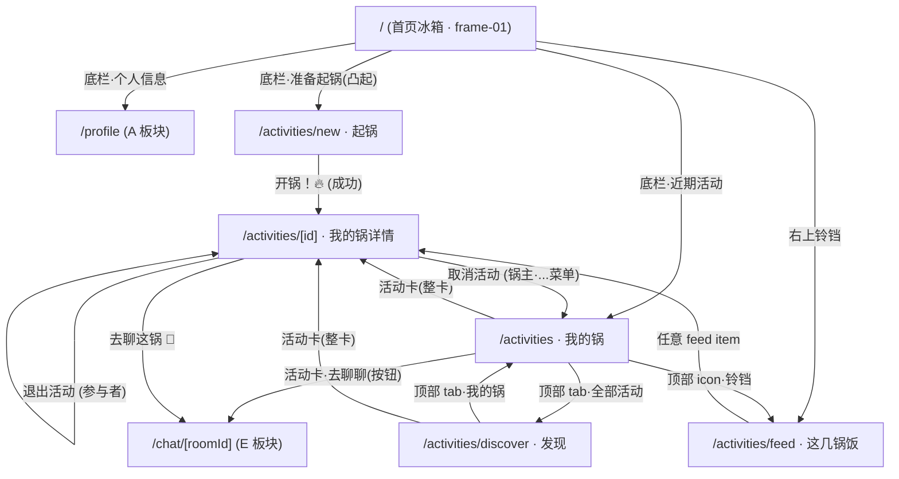

# Module C · 活动锅 · Design Spec

> **状态**：Draft · 待用户验收
> **日期**：2026-04-20
> **作者**：A+C 维护者（本仓库）
> **依赖**：
> - `TEAM-CONTRACT.md` §1 技术栈 / §3 开发原则 / §4 基础设施 / §6 C 板块 / §6.7 活动消息中心 / §7 对 B/D/E/F 契约
> - `docs/superpowers/specs/0-design-system.md` 全量
> - `邻食V2_utf8.txt` PRD § MVP 范围 / 活动锅页面 / § 信任与安全机制
> - Figma frames: `frame-01, frame-05, frame-06, frame-07, frame-08, frame-09, frame-10, frame-12, frame-15, frame-16`
>
> **范围边界**：本 spec 只覆盖 C 板块前端 + C 板块前端对后端的消费契约。**后端数据模型 / API / 状态机 / 定时任务已在 TEAM-CONTRACT §6 锁定，本 spec 一概只引用章节号，绝不重写**。自创元素（发现页、`joinScope` 卡片、消息中心入口）必须严格使用 `0-design-system.md` 中的 tokens。

---

## §1 范围与路由

### §1.1 前端页面清单

| # | 路由 | 页面名 | Figma 来源 | 备注 |
|---|---|---|---|---|
| 1 | `/(protected)/activities/discover` | 发现所有活动 | **无稿·自创** | 基于 `frame-06` 卡片视觉 + 顶部筛选条 |
| 2 | `/(protected)/activities` | 我的锅列表 | `frame-06` | 默认 tab "我的锅"，tab 2 切到 `/discover` |
| 3 | `/(protected)/activities/new` | 起锅（创建活动） | `frame-05` | 加自创"加入范围"卡片（Figma 缺稿，契约必填） |
| 4 | `/(protected)/activities/[id]` | 我的锅详情 | `frame-12`（主） + `frame-15 / frame-16`（数据变体参考） | 独立 Page（非 Drawer），详见 §3 |
| 5 | `/(protected)/activities/feed` | 活动消息中心（"这几锅饭"） | `frame-07 / 08 / 09 / 10`（4 个 tab 对应） | 4 个 tab：全部 / 未读 / 进行中 / 快开始 |

### §1.2 全局底栏（A + C 共担）

- 位置：`apps/web/src/app/(protected)/layout.tsx`
- Figma：`frame-01`（底部三件套：`个人信息 / 准备起锅🔥（凸起）/ 近期活动`）
- 详细设计见 §4.6。

### §1.3 Figma 对照表（硬映射）

| Figma frame | 对应页面 | 关键元素 |
|---|---|---|
| `frame-01` | 首页冰箱（非 C 负责，但底栏由 C 实现） | 底栏三件套 + 右上"我的锅"胶囊徽标 + 铃铛 |
| `frame-05` | `/activities/new` | 6 张卡片 + "开锅！🔥" 主 CTA |
| `frame-06` | `/activities` | 3 张活动卡（进行中/快开始/招募中 三色 chip 示例） |
| `frame-07` | `/activities/feed?tab=all` | "全部" tab 激活 |
| `frame-08` | `/activities/feed?tab=unread` | "未读" tab 激活（单条结果） |
| `frame-09` | `/activities/feed?tab=in-progress` | "进行中" tab 激活（单条结果） |
| `frame-10` | `/activities/feed?tab=starting-soon` | "快开始" tab 激活（单条结果） |
| `frame-12` | `/activities/[id]`（2/3 FORMED→IN_PROGRESS 过渡态） | 系统推荐菜卡 · 参与者列表 · 动态 · 橙色 CTA |
| `frame-15` | 同 `frame-12` · 数据变体（4/5 人） | 用于验证卡片在多人场景的布局 |
| `frame-16` | 同 `frame-12` · 数据变体（1/4 招募中） | 用于验证空位占位符 + 动态只有 1 条时的最小态 |

> **Figma 真实性提示（重要）**：Figma 展示的 chip 文案/颜色是**静态示例**（例如 `frame-06` 里 "2/3 人" 的活动挂着"进行中"绿色 chip，这在真实状态机下与 `IN_PROGRESS` 不兼容——因为 IN_PROGRESS 要求已 FORMED 且已过 startTime）。**实现时 chip / CTA / banner 的文案与颜色必须由 `activity.status` 驱动**（见 §6），不照搬 Figma 字面。

---

## §2 导航流

### §2.1 Mermaid



### §2.2 文字版

- **底栏·准备起锅🔥（凸起）** → `/activities/new`。全局可见（登录态）。
- **底栏·近期活动** → `/activities`（默认 tab "我的锅"）。底栏 icon 右上叠**未读红点**（基于 `GET /activity-feeds?status=UNREAD` `items.length > 0`）。
- `/activities` 顶部 2-tab 切换 "**我的锅 / 全部活动**"；后者跳 `/activities/discover`。
- 点击任意活动卡（整卡区域）→ `/activities/[id]`。
- 活动卡右下 **"去聊聊"** 按钮（仅当 `chatRoomId !== null` 时启用）→ 直接跳 `/chat/[roomId]`，**跳过详情页**。
- `/activities/[id]` 底部 **"去聊这锅 💬"** CTA → `/chat/[roomId]`（E 板块）。
- `/activities/feed` 入口：**右上铃铛**位于 `frame-01` 首页的 header 右侧（已在 Figma 出现），以及 `/activities` 顶部右上同位置。**不**占用底栏槽位（底栏三件套已满，见 §4.6）。见 §13 风险 3 — 此入口位置需用户确认。

### §2.3 返回键行为（`/activities` 的特例）

`frame-06` 左上角画的是 `<` 返回箭头，但 `/activities` 实际是底栏一级目标。约定：
- 从底栏进入 → 隐藏返回箭头，左上留空或放"我的锅"标题即可
- 从其它页（例如 `/activities/new` 创建后）跳入 → 显示返回箭头，点击走 `router.back()`
- 实现：`useSearchParams().get('from')` 或判断 `history.length > 1`，择简

---

## §3 信息架构（L0–L3）

基于 `frontend-logic-design` 方法论（渐进披露 + 一致性矩阵 + 施耐德曼法则）。

### §3.1 层级划分

| 层 | 含义 | 本模块对应页 |
|---|---|---|
| L0 · 概览 | 全量列表/汇总视图，低决策成本 | `/activities`（我的锅列表）· `/activities/feed`（消息中心）· `/activities/discover`（发现列表） |
| L1 · 聚焦 | 单个实体的完整信息面板 | `/activities/[id]`（详情） |
| L2 · 管理 | 创建 / 批量编辑 / 配置 | `/activities/new`（创建） |
| L3 · 执行 | 跨模块跳转到真正"做事" | `/chat/[roomId]`（E 板块，去聊这锅） |

### §3.2 Page vs Drawer 决策（`/activities/[id]`）

- 按 `frontend-logic-design` 的 "L1 详情 Page vs Drawer" 决策矩阵：
  - ✅ 信息量大：header + 时间地点卡 + 系统推荐菜 + 参与者列表 + 动态 + 底部 CTA，共 5 个独立 section
  - ✅ 多数据变体（`frame-12/15/16` 呈现 3 种参与者数 × 3 种状态组合）
  - ✅ 用户可能长时间停留（等人加入、看动态、切 tab 回来）
  - ✅ 需要支持 deep-link（分享给朋友 → 朋友打开直接看详情）
- 结论：**走独立 Page**（`/activities/[id]`），**不用 Drawer**。

### §3.3 一致性矩阵

跨 4 个 L0+L1 页的关键元素必须一致呈现：

| 元素 | `/activities`（列表） | `/activities/discover`（发现） | `/activities/[id]`（详情） | `/activities/feed`（消息中心） |
|---|---|---|---|---|
| 活动 emoji | 左上角 48×48 圆形底 | 同列表 | header 下方大图（非必须，预留） | 左上 40×40 |
| 活动标题 | `text-h3`（18/26 · 600） | 同列表 | `text-h1`（24/32 · 700） · 居中 | `text-body`（16/24 · 500） |
| 状态 chip | 卡右上 | 同列表 | 顶部 banner 区（见 §6） | 卡左下（Figma 示例） |
| 人数进度 | 橙色条 + "X/Y 人" 标签 | 同列表 | "X/Y 人已加入" + 不显式条（仅文字） | 不显示 |
| 次 CTA | "去聊聊"（右下橙按钮） | 不显示（只跳详情） | 详情页顶部有"邀请朋友" secondary 按钮（WAITING 态） | 不显示 |
| 主 CTA | 无（整卡点击即进入） | 无 | 底部固定"去聊这锅💬"橙色 | 无（整条点击即跳详情） |

---

## §4 页面逐一详述

### §4.1 `/activities` 我的锅列表 · `frame-06`

#### §4.1.1 视觉结构（自顶向下）

1. **Header**（`space-4` padding，高 56px）
   - 左：返回箭头（按 §2.3 条件显示）
   - 中：`text-h1` "我的锅"
   - 右：`BellIcon`（跳 `/activities/feed`），icon 上叠未读红点
2. **Tab 栏**（高 44px，粘顶）
   - 2 个 tab：**我的锅** · **全部活动**
   - 选中 tab：文字 `brand.primary.500` · 下方 2px 粉色下划线；未选中：`neutral.500`
   - 点击"全部活动"→ `router.push('/activities/discover')`
   - 切换不用 React 内 tab 状态（两 tab 分别是独立路由）
3. **活动卡列表**（垂直 stack，卡间 `space-3`，左右 `space-4`）
   - 单卡（Figma `frame-06` 逐像素对照）：
     - 高 ~120px · `rounded-lg` · `neutral.0` 底 · `shadow-md`
     - 顶部行：emoji（圆形底 `neutral.100`, 48×48）+ 右侧 2 行文字 {`text-h3` 活动标题, `text-body-sm` `neutral.500` "发起人·地点" 或 "参与者·地点"} + 右上状态 chip
     - 分隔线（`neutral.200` · 1px · 左右留 `space-4`）
     - 中部行：`📆` emoji + "今晚 7:00" · `📍` emoji + "杨浦区"，`text-body-sm` · `neutral.700`
     - 底部行：橙色进度条（每格 `space-3` 宽，已填 = `accent.peach.500`，未填 = `neutral.200`） + "2/3 人" + 右侧橙色 "去聊聊" 按钮（`rounded-full` · `accent.peach.500` · 高 32px · 白字 `text-body-sm`）
4. **空态**（§8）
5. **加载态**（§8）
6. **底部安全区**：`max(env(safe-area-inset-bottom), 16px)` + 底栏高度 72px

#### §4.1.2 交互

- **整卡点击** → `/activities/[id]`
- **"去聊聊"按钮点击**（`stopPropagation`）→ 直接跳 `/chat/[roomId]`
- **下拉刷新**：React Query `refetch`
- **无限滚动**：`useInfiniteQuery` 分页（`pageSize = 20`）；`IntersectionObserver` 触发
- **长按卡片**：非 MVP，不实现

#### §4.1.3 状态 chip 文案与配色

按 `activity.status` 驱动（**不照搬 Figma 字面**）：

| status | chip 文案 | chip 背景 | chip 文字 |
|---|---|---|---|
| `WAITING_FOR_MEMBERS` | 招募中 | `brand.primary.100` | `brand.primary.700` |
| `FORMED` | 已成局 | `success.100` | `success.500` |
| `STARTING_SOON` | 快开始 | `warning.100` | `warning.500` |
| `IN_PROGRESS` | 进行中 | `success.100` | `success.500` |
| `COMPLETED` | 已结束 | `neutral.200` | `neutral.500` |
| `CANCELLED` | 已取消 | `danger.100` | `danger.500` |

#### §4.1.4 "去聊聊"按钮可用性规则

- `activity.chatRoomId !== null` → 启用，`accent.peach.500`
- `activity.chatRoomId === null`（WAITING 态尚未建房）→ **禁用**，底色 `neutral.200`，文字 "招募中"，点击无跳转

#### §4.1.5 数据接入

- 端点：`GET /activities?scope=MINE&sort=-updatedAt`（**查询参数 `scope` 为对 §6.3 的契约扩展，见 §9.2；后端需追加**）
- React Query key：`['activities', { scope: 'MINE' }]`
- `staleTime: 30_000` · `refetchOnWindowFocus: true`
- 关键响应字段：`ActivitySchema[]`（§6.3 已定义）

#### §4.1.6 空 / 加载 / 错误三态

见 §8。空态复刻 PRD："还没有锅在煮呢 / 去起一锅 →"，按钮跳 `/activities/new`。

#### §4.1.7 Playwright 验收

- 桌面 1440×900 + 移动 393×852 各过一遍
- 用例：登录 → 跳 `/activities` → 空态按钮可见 → 创建一个活动 → 回到列表看到卡片 → 点"去聊聊"跳聊天 → 回来点整卡跳详情

---

### §4.2 `/activities/discover` 发现所有活动 · **自创**（无 Figma）

#### §4.2.1 设计依据

- 视觉：**完全复用** §4.1 的活动卡样式，不引入新卡片型态。
- 差异点：顶部追加**筛选条**（粘顶，高 48px）。
- 用户画像：已登录用户想浏览**非自己参与**的公开活动池，按需筛选。

#### §4.2.2 视觉结构

1. Header 同 §4.1（但面包屑"全部活动"，无 BellIcon；bell 只在 /activities）
2. Tab 栏：**我的锅 / 全部活动**（当前激活"全部活动"）
3. **筛选条**（横向滚动容器，左右 `space-4`，gap `space-2`）
   - 4 个筛选 chip（按下弹 BottomSheet 选择）：
     - **状态** - 默认 "招募中" · 可选：{招募中, 快开始, 全部}
     - **时间** - 默认 "任意" · 可选：{今晚, 明晚, 本周末, 下周末, 自定义范围}
     - **人数** - 默认 "任意" · 可选：{2-4 人, 5-6 人, 7-10 人, 任意}
     - **加入范围** - 默认 "任意" · 可选：{熟人扩展（ACQUAINTANCES_ONLY）, 接受陌生人（STRANGERS_OK）, 仅高信用（HIGH_TRUST_ONLY）, 任意}
   - chip 视觉：`rounded-full` · `neutral.100` 底 · `text-body-sm` · 激活态（非"任意"）切 `brand.primary.200` 底 + `brand.primary.700` 文字 + 右侧×清除
4. 活动卡列表：同 §4.1，但**卡片点击"去聊聊"按钮不出现**（陌生活动不允许直通聊天）；整卡点击 → 详情。
5. 空态：emoji `🍳` + "没有符合条件的锅 / 试试放宽条件"

#### §4.2.3 数据接入

- 端点：`GET /activities`（§6.4），query 参数构造：
  - `status` 映射筛选
  - `joinScope` 映射筛选
  - `from` / `to` 映射"时间"选项（服务端时区以服务器时区为准；前端构造 ISO8601 传递）
  - `minParticipants` / `maxParticipants` → **对 §6.3 `ListActivitiesQuerySchema` 的契约扩展，见 §9.2**
  - 默认排除 `status=CANCELLED,COMPLETED` + 排除 `createdBy=me` + 排除 `joinedBy=me`（见 §9.2 扩展）
- React Query key：`['activities', { scope: 'DISCOVER', filters }]`
- 时间筛选映射规则（前端计算）：
  - "今晚" → `from=today 17:00`, `to=today 23:59`
  - "明晚" → `from=tomorrow 17:00`, `to=tomorrow 23:59`
  - "本周末" → 本周六 00:00 至本周日 23:59
  - "下周末" → 下周六 00:00 至下周日 23:59

#### §4.2.4 Playwright

- 用例：打开发现页 → 默认看到"招募中"列表 → 切"快开始" → 清除筛选回"招募中" → 点整卡进详情

---

### §4.3 `/activities/new` 起锅 · `frame-05`

#### §4.3.1 视觉拆解

逐卡对照 Figma（每卡 `rounded-lg` · `neutral.0` 底 · `shadow-sm` · padding `space-4` · 卡间 `space-3`）：

1. **Header**：`text-display` "邻食" + 右上装饰锅 emoji（`frame-05` 顶部有一个锅 emoji）
2. **卡片 1：这锅做什么？**
   - 标题 `text-h3` "这锅做什么？"
   - Input（高 48px · `rounded-md` · `neutral.100` 底 · `text-body`）
   - placeholder "起个锅名，比如「今晚煮面」"
   - `maxLength=80`（匹配 §6.3 `ActivitySchema.title`）
3. **卡片 2：时间**
   - 标题 `text-h3` "时间"
   - 一排 5 个 chip（换行 flex-wrap）：`今晚 / 明晚 / 本周末 / 下周末 / 自定义`
   - chip：`rounded-full` · 未选 `neutral.100` · 选中 `brand.primary.200` + `brand.primary.700` 字
   - "自定义" 点击 → 打开日期+时间选择器（shadcn Dialog + input type="datetime-local"）
   - 快捷选项映射：
     - 今晚 → 今天 19:00 本地时区
     - 明晚 → 明天 19:00
     - 本周末 → 本周六 18:00（如今日已周六/周日 → 下周六 18:00）
     - 下周末 → 下周六 18:00
   - 底部：已选时间展示 `text-body-sm` · `neutral.700`（例 "4 月 20 日 周日 19:00"）
4. **卡片 3：地点**
   - 标题 + Input（同卡片 1 视觉）
   - placeholder "大概的区域就好，不用精确地址"
   - `maxLength=200`
5. **卡片 4：人数上限**
   - 标题 `text-h3` "人数上限"
   - 计数器行：`-` 圆按钮（`neutral.100` 底）· 大数字 `text-display`（tabular-nums）· `+` 圆按钮
   - 条形可视化：6 格（对应 2-7 常用 + 可扩到 10；超 6 人时后 4 格共用一段）
     - 已填格：`accent.peach.400`
     - 未填格：`neutral.200`
   - 范围：2–10（匹配 §6.3 `maxParticipants`），默认 3
6. **卡片 5：我带的食材（从冰箱选）**
   - 标题 `text-h3` "我带的食材（从冰箱选）"
   - 数据源：`IngredientsClient.listByUser(me.id)`（§7.1），走前端的 `ingredientsClient.listByUser()` wrapper
   - 网格展示：3 列 · 每格食材 chip（emoji + 名称，`rounded-full` · `neutral.100`）
   - 多选：点击切换选中 → `brand.primary.200` 底
   - Figma 示例食材：🥦 西兰花 / 🥕 胡萝卜 / 🍋 柠檬 / 🌽 玉米 / 🥬 生菜 / 🧅 洋葱 / 🫐 蓝莓
   - **空态**（B 未就绪时）：`neutral.500` 一行文字 "冰箱还没有食材，先去拍照识别 →"（跳 `/fridge`，B 未就绪时按钮禁用展示 "待上线"）
   - **fallback**（见 §13 风险 4）：若 B 未就绪，允许用户**手动输入食材名**（文本 input 回车添加 chip）。此时食材以**纯文字**暂存在表单，后端 `ingredientIds: []` 留空，**但** `description` 字段拼接 "自带食材: xxx, yyy"（后端不感知 fallback，MVP 过渡）
7. **卡片 6：加入范围** · **自创**（Figma 缺稿，但 §6.3 契约必填）
   - 标题 `text-h3` "加入范围"
   - 副标题 `text-body-sm` · `neutral.500` "这锅开放给谁？"
   - 3 个 radio chip（单选）：
     - **熟人扩展**（`ACQUAINTANCES_ONLY`）· 默认选中
     - **接受陌生人**（`STRANGERS_OK`）
     - **仅高信用**（`HIGH_TRUST_ONLY`）
   - chip 视觉：`rounded-full` · 未选 `neutral.100` · 选中 `brand.primary.200`
   - 每个 chip 下方一行 `text-caption` · `neutral.500` 解释文案（参考 PRD § 5 分层开放）：
     - 熟人扩展：朋友的朋友可加入
     - 接受陌生人：所有符合条件的用户可加入
     - 仅高信用：信用分 ≥70 的用户可加入（私人场景）
8. **卡片 7：补充说明**
   - 标题 `text-h3` "补充说明"
   - textarea（高 80px · `rounded-md` · `neutral.100` · `maxLength=500`）
   - placeholder "一句话说说氛围或要求..."
9. **底部粘底 CTA**："开锅！🔥"
   - 宽度：减去左右 `space-4` 后满宽
   - 高 56px · `rounded-2xl` · `gradient-cta` 底 · `shadow-glow-primary`
   - 文字 `text-button` bold + 白色
   - `scalePressIn` 按压动效（`motion/presets`）

#### §4.3.2 表单 & 校验

```ts
// 校验源头：CreateActivityRequestSchema（§6.3）
const form = useForm<CreateActivityRequest>({
  resolver: zodResolver(CreateActivityRequestSchema),
  defaultValues: {
    title: '',
    description: null,
    startTime: '', // 空字符串；提交前由时间快捷选项或自定义器填充 ISO
    location: '',
    maxParticipants: 3,
    joinScope: 'ACQUAINTANCES_ONLY',
    ingredientIds: [],
  },
});
```

- 额外校验（前端早报错，服务端二次）：
  - `startTime > NOW`（服务端对应 `ACTIVITY_START_IN_PAST`）
  - `ingredientIds` 每个 uuid 必须属于当前用户（`IngredientsClient.listByUser` 的子集）
- 校验错误呈现：字段下方 `text-body-sm` · `danger.500`
- 主 CTA 在表单 `isValid` false 时禁用（底色降到 `brand.primary.200`）

#### §4.3.3 提交流程

1. `POST /activities`，body = `CreateActivityRequest`
2. 成功 → `toast.success("锅已开 🔥")` → `router.replace('/activities/' + res.id)`
3. 失败映射：
   - `ACTIVITY_START_IN_PAST` → 时间字段 error + toast "开锅时间必须在未来哦"
   - `ACTIVITY_INGREDIENT_NOT_FOUND` → 食材字段 error + 清空 `ingredientIds` 并提示"部分食材失效，请重新选择"
   - 通用错误 → §8.3 错误 toast

#### §4.3.4 Playwright

- 桌面 + 移动各过：
  - 空表单提交 → 校验错误
  - 填完全表单 → 点 "开锅！🔥" → 跳详情
  - 时间选"今晚"自动带入
  - 加入范围选"仅高信用"看到解释文案

---

### §4.4 `/activities/[id]` 我的锅详情 · `frame-12 / 15 / 16`

#### §4.4.1 视觉结构（自顶向下）

1. **Header**（居中，`gradient-warm` 浅背景区 ~120px）
   - 左：返回箭头
   - 中：两行标题
     - 第 1 行 `text-h1` bold："今晚煮番茄鸡蛋面"
     - 第 2 行 `text-body-sm` · `neutral.500`："发起人·杨浦区" 或 "参与者·静安区"
   - 右：`InfoIcon`（打开 BottomSheet 展示活动元信息 - 创建时间 / 描述 / joinScope）
2. **状态 banner 区**（条件显示，见 §6）
   - 高 36px 或隐藏
3. **时间地点卡**（`rounded-lg` · `neutral.0` · padding `space-4`）
   - 行 1：`📆` "今晚 7:00" · `📍` "杨浦区"（`text-body` · `neutral.700`）
   - 行 2：`text-h3` `accent.peach.500` "2/3 人已加入"
4. **系统推荐菜卡**
   - 行 1：`🔍` "系统推荐菜" `text-body-sm` · `neutral.500`
   - 行 2：`text-h3` 菜名（例 "番茄鸡蛋面"）
   - 行 3：`text-body-sm` · `neutral.700` 描述（"你有番茄🍅鸡蛋🥚，柴桥子有面条🍜"）
   - 数据源：`MatchingClient.getSuggestion(activityId)`（§7.2 D 板块；MVP 未就绪）
   - **Fallback 文案**（D 未就绪或返回 null）：
     - 菜名："系统推荐菜 · {activity.title}"
     - 描述：若人数 ≥ 2 "等待更多食友和食材加入..."；否则 "等待第一位食友加入..."
     - 参见 `frame-16` 的 1/4 人变体（已是 fallback 文案）
5. **参与者列表卡**
   - 标题行：`👥` "参与者（X/Y）" `text-h3`
   - 每条参与者行（`rounded-md` · `neutral.50` 底，内 padding `space-3`）：
     - 左：emoji 头像（48×48 圆形 `neutral.100`） + 昵称（`text-h3`） + 下方 `text-caption` · `brand.primary.500` 标签（"锅主" or "参与者"）
     - 右：该用户**带入的食材 emoji**横向排列（最多展示 3 个；更多显示 "+N"）
       - 数据源：`activity.ingredients.filter(i => i.addedBy === userId)` → 用 `IngredientsClient.getByIds([...])` 填充 emoji 和名字
   - 空位占位符行（虚线框 · `neutral.200` · `text-body-sm` · `neutral.400`）："还差 N 人，等待食友加入..."
     - 当 `participantCount === maxParticipants` 时不显示
6. **动态卡**
   - 标题：`📋` "动态" `text-h3`
   - 最新 5 条 timeline（竖线 `neutral.200` + 黄点 `warning.500`）
   - 每条：
     - `text-body` · `neutral.700`：动态文案（由 type 决定，见 §4.4.3）
     - `text-caption` · `neutral.400`：相对时间（"2 小时前"、"3 分钟前"）
   - "查看全部" 链接 → 展开完整列表（分页）
7. **底部粘底 CTA**（高 80px 容器 · `neutral.0` 底 · 上边 1px `neutral.200`）
   - 按钮分身份（见 §4.4.4）

#### §4.4.2 状态机 UI 映射（必须完整覆盖 6 态）

| `status` | 顶部 banner | 主 CTA 文案 | 主 CTA 底色 | 次 CTA | 备注 |
|---|---|---|---|---|---|
| `WAITING_FOR_MEMBERS` | 不显示 | **招募中 · 还差 X 人** · 禁用态 | `neutral.200` 底 · `neutral.500` 字 | **邀请朋友**（`accent.peach.500` 描边，白底橙字） · secondary | 非参与者见"加入这锅 🍲"（`brand.primary.500` 主 CTA，§4.4.4） |
| `FORMED` | 不显示 | **去聊这锅 💬** | `accent.peach.500` | 无（锅主可在 ... 菜单取消） | 已拉群；`chatRoomId != null` |
| `STARTING_SOON` | `warning.100` 底 · `warning.500` 字 · "距离开饭还有 X 分钟" · tabular-nums | **去聊这锅 💬** | `accent.peach.500` | 无 | 倒计时每 30s 前端自更；状态依赖服务端 |
| `IN_PROGRESS` | `success.100` 底 · `success.500` 字 · "进行中 · 已开始 X 分钟" | **去聊这锅 💬** | `accent.peach.500` | 无 | — |
| `COMPLETED` | `neutral.200` 底 · `neutral.500` 字 · "活动已结束" | **查看回顾**（MVP 禁用） | `neutral.200` 底 · `neutral.400` 字 | 无 | 全卡片灰度 `opacity-60` |
| `CANCELLED` | `danger.100` 底 · `danger.500` 字 · "活动已取消" | **去聊这锅** 禁用 | `neutral.200` 底 · `neutral.400` 字 | 无 | 全卡片灰度；锅主不可再取消 |

#### §4.4.3 动态（activity event）类型 → 文案映射

后端 `ActivityEventTypeEnum`（§5.2）→ 前端渲染：

| type | 文案模板（`{actor}` 为 actor_id → nickname） | payload 取值 |
|---|---|---|
| `CREATED` | "{actor} 发起了这锅" | — |
| `JOINED` | "{actor} 加入了锅" | — |
| `LEFT` | "{actor} 离开了锅" | — |
| `FORMED` | "成局啦，一共 {count} 人 ✨" | `payload.participantIds.length` |
| `STATUS_CHANGED` | 按 `toStatus` 映射：`STARTING_SOON`→"距离开饭还有 1 小时 ⏰"；`IN_PROGRESS`→"开饭啦 🍽️"；`COMPLETED`→"吃完啦 ✨" | `payload.toStatus` |
| `INGREDIENT_ADDED` | "{actor} 带了 {ingredientNames} 加入" | `payload.ingredientName` |
| `INGREDIENT_REMOVED` | "{actor} 取回了 {ingredientName}" | — |
| `CANCELLED` | 若 `reason=BY_CREATOR` "{actor} 取消了活动"；若 `reason=EXPIRED` "没人加入，锅凉了 🧊" | `payload.reason` |
| `COMPLETED` | "活动完成啦 🎉" | — |

特殊："系统推荐了 {dishName} ✨" 属于 D 板块推送的 `SYSTEM_SUGGESTION` type，MVP 不实现；`frame-12` 里出现的是占位文案。

#### §4.4.4 身份视角（身份判定）

```ts
const isCreator = activity.createdBy === me.id;
const isParticipant = activity.participants.some(p => p.userId === me.id && p.leftAt === null);
```

**主 CTA 决策表**：

| 身份 × 状态 | 主 CTA | 说明 |
|---|---|---|
| 锅主 + WAITING | "招募中 · 还差 X 人" 禁用 + "邀请朋友" secondary | 不能加入自己的锅；可取消（...菜单） |
| 锅主 + FORMED 及以后 | "去聊这锅 💬" | 右上 ... 菜单显示"取消活动"（若非 COMPLETED） |
| 参与者（非锅主）+ WAITING | "退出活动" secondary · 底色 `neutral.100` + 文字 `neutral.700` | 主 CTA 还是 "招募中" 禁用 |
| 参与者（非锅主）+ FORMED 及以后 | "去聊这锅 💬" + "退出活动" secondary | — |
| 非参与者 + WAITING | **加入这锅 🍲**（`brand.primary.500` 主 CTA） | 点击 → `POST /activities/:id/join` |
| 非参与者 + FORMED 及以后 | "已满员，下次再来"（禁用） | 或 "招募已关闭" |

#### §4.4.5 数据接入

- 主端点：`GET /activities/:id` (§6.4) → `ActivityDetailSchema`
- 动态端点：`GET /activities/:id/events?page=1&pageSize=5` → 再按需分页
- 参与者食材：活动详情响应里已带 `ingredients[]`（含 `addedBy`）→ 前端 `useMemo` 按 userId 聚合 → 调 `IngredientsClient.getByIds` 拉详情（B 未就绪返回空数组，UI 降级到只展示头像无食材）
- 系统推荐菜：`MatchingClient.getSuggestion(activityId)`（§7.2）· **D 未就绪时 return null 走 fallback 文案**
- React Query：
  - key：`['activity', id]`
  - `staleTime: 0`
  - `refetchInterval: 10_000`（10s 轮询）
  - `refetchIntervalInBackground: false`（页面不可见时暂停）
  - 额外：监听 `document.visibilitychange` 事件，visible 时立即 `refetch()` 一次（catch up）

#### §4.4.6 操作流程

**加入**：
1. 点 "加入这锅 🍲" → optimistic：participants 先 push 一个 placeholder
2. `POST /activities/:id/join`
3. 成功 → `invalidateQueries(['activity', id])`
4. 失败映射：
   - `ACTIVITY_FULL` → toast "这锅满了" + 刷新
   - `ACTIVITY_ALREADY_JOINED` → toast "你已经在锅里啦"
   - `ACTIVITY_NOT_JOINABLE` → toast "这锅已关门"
   - `ACTIVITY_SCOPE_FORBIDS` → toast "这锅只对高信用用户开放"
   - `ACTIVITY_NOT_FOUND` → 跳 404

**退出**：
1. 点 "退出活动" → 打开 shadcn AlertDialog 二次确认："确定退出这锅？"
2. 确认 → `POST /activities/:id/leave`
3. 成功 → invalidate
4. 失败映射：
   - `ACTIVITY_NOT_JOINED` → toast 后刷新
   - `ACTIVITY_NOT_LEAVABLE` → toast "活动已开始，不能退出了"

**取消（锅主）**：
1. 右上 ... 菜单 → "取消活动" (`danger.500`)
2. AlertDialog："确定取消这锅？已加入的朋友会收到通知" 二次确认
3. `DELETE /activities/:id`
4. 成功 → `router.replace('/activities')`
5. 失败映射：
   - `ACTIVITY_NOT_CANCELLABLE` → toast "活动已结束，无法取消"

#### §4.4.7 错误态

- `ACTIVITY_NOT_FOUND`：全屏空态，emoji `🧊` + "这锅凉了 🧊" + "返回我的锅" 按钮 → `/activities`

#### §4.4.8 Playwright 验收

- 覆盖 3 种身份：锅主 / 参与者 / 非参与者
- 覆盖 6 状态：mock 后端时 seed 6 个活动各一状态，点进去验证 CTA / banner / chip
- 覆盖 3 个操作：join / leave / cancel
- 10s 轮询：等待 ≥10s 后 seed 另一用户 join，观察 UI 更新（或加快 refetchInterval 做短 test）

---

### §4.5 `/activities/feed` 活动消息中心 · `frame-07 / 08 / 09 / 10`

#### §4.5.1 视觉结构

1. **Header**
   - 左：返回箭头
   - 中：`text-h1` "这几锅饭"
   - 右：... 菜单（MVP 留空或放"全部标为已读"）
2. **Tab 栏**（4 tab，横向，高 44px）
   - **全部 / 未读 / 进行中 / 快开始**
   - 视觉：`rounded-full` chip，选中 `brand.primary.200` + `brand.primary.700` 字 + 轻 `shadow-sm`；未选 `neutral.50` 或透明 + `neutral.500` 字
   - Figma 对照：4 个 frame 展示 4 种激活状态
3. **Feed 列表**（卡间 `space-3`，左右 `space-4`）
   - 单卡（高 ~80px · `rounded-lg` · `neutral.0` · `shadow-sm`）：
     - 左：活动 emoji 头像（`neutral.100` 圆形 48×48）+ 右上未读红点 badge（`brand.primary.500` · 白字 · `text-caption` 数字）
     - 中：
       - 行 1：`text-h3` 活动标题
       - 行 2：`text-body-sm` · `neutral.700` 消息预览（`{senderNickname}: {preview}` 或 `系统: {preview}`，截断至 30 字）
       - 行 3（条件）：状态 chip（同 §4.1.3 配色）
     - 右上：`text-caption` · `neutral.400` 相对时间（"2 分钟前" / "30 分钟前" / "昨天"）
4. **空态**（按 tab）：
   - 全部："还没有活动消息"（emoji `🍳`）
   - 未读："没有未读消息 🎉"
   - 进行中："暂无进行中的活动"
   - 快开始："近期没有快开始的活动"

#### §4.5.2 交互

- Tab 切换：变更 URL query `?tab=all|unread|in-progress|starting-soon` + 各自 query key
- 整条点击 → `/activities/[activityId]` + **先调 `POST /activity-feeds/:activityId/read`**（标记已读）再跳
  - 本地 optimistic：先将该 feed 的 `unreadCount` 置 0
- 下拉刷新 + 无限滚动

#### §4.5.3 数据接入

- 端点（§6.7）：`GET /activity-feeds?status=<ALL|UNREAD|IN_PROGRESS|STARTING_SOON>&page=&pageSize=`
- 4 个 tab 4 个独立 query key：
  - `['activity-feeds', { status: 'ALL' }]`
  - `['activity-feeds', { status: 'UNREAD' }]`
  - `['activity-feeds', { status: 'IN_PROGRESS' }]`
  - `['activity-feeds', { status: 'STARTING_SOON' }]`
- `staleTime: 15_000`
- 标记已读：`POST /activity-feeds/:activityId/read`，成功后 invalidate 全部 4 个 key
- 底栏右侧未读红点：从全局 `useQuery(['activity-feeds', { status: 'UNREAD' }])` 的 `items.length > 0` 推导

#### §4.5.4 Playwright

- 4 个 tab 切换都返回预期数据或空态
- 点单条 → 跳详情 + 回来红点消失

---

### §4.6 全局底栏 · `(protected)/layout.tsx` · `frame-01`（A + C 共担）

#### §4.6.1 视觉结构

固定底部，高 72px，`neutral.0` 底 · 上边 1px `neutral.100` · `shadow-lg` 向上投射。

```
┌────────────┬──────────────┬────────────┐
│    👤       │      🔥       │    ⭐       │
│   个人信息   │   准备起锅    │   近期活动   │
│            │   (凸起 56px)  │   (●红点)   │
└────────────┴──────────────┴────────────┘
```

- **左**：`UserIcon` 24px · `text-caption` "个人信息" · `neutral.500`（激活 `brand.primary.500`）· tap → `/profile`
- **中（PotButton · 凸起）**：
  - 圆 56px · `gradient-cta` 底 · `shadow-glow-primary`
  - 文字 "准备起锅" 位于圆下方
  - 圆内锅 emoji 或自定义 `PotIcon`
  - tap → `/activities/new`
  - `scalePressIn` 按压动效
- **右**：`StarIcon` 或 `ActivityIcon` · "近期活动" · tap → `/activities`
  - icon 右上叠 `brand.primary.500` 红点（6×6 圆）当 UNREAD 未读 feed > 0

#### §4.6.2 组件实现

- `BottomNav`（`components/nav/BottomNav.tsx`）：外层容器 + 3 个 slot
- `PotButton`（`components/nav/PotButton.tsx`）：凸起按钮
- 参见 `0-design-system.md` §7.3 + §8.2

#### §4.6.3 激活态判定

- `usePathname()` 匹配：
  - `/profile*` → 左亮
  - `/activities/new` → 中亮（`PotButton` 内多一层亮边）
  - `/activities` 或 `/activities/[id]` 或 `/activities/feed` 或 `/activities/discover` → 右亮

#### §4.6.4 安全区

- 容器 `padding-bottom: max(env(safe-area-inset-bottom), 16px)`
- iOS 刘海屏 home indicator 不覆盖

#### §4.6.5 页面层级

- 在列表类页面（`/activities` / `/activities/discover` / `/activities/feed`）底栏可见
- 在 `/activities/[id]` 底栏**被详情页自己的底部粘底 CTA 覆盖**（详情页层级更高）—— 实现：详情页在 `layout` 外层用 `bottom: 0` fixed CTA，底栏在内层；或在 `[id]/page.tsx` 里 `useLayoutEffect` 隐藏 `<BottomNav>`，两种方案任选其一，推荐后者（状态纯净）
- 在 `/activities/new` 底栏**隐藏**（让位给粘底 "开锅！🔥"）

---

## §5 API 调用地图

| 页面 | 端点 | React Query key | 触发 |
|---|---|---|---|
| `/activities` | `GET /activities?scope=MINE` | `['activities', { scope: 'MINE' }]` | mount, 下拉 |
| `/activities/discover` | `GET /activities?status=&joinScope=&from=&to=&minParticipants=&maxParticipants=` | `['activities', { scope: 'DISCOVER', ...filters }]` | mount, 筛选变 |
| `/activities/new` | `GET /me/ingredients` (经 IngredientsClient) | `['ingredients', { userId: me.id }]` | mount |
| `/activities/new` | `POST /activities` | — | submit |
| `/activities/[id]` | `GET /activities/:id` | `['activity', id]` | mount, 10s poll |
| `/activities/[id]` | `GET /activities/:id/events` | `['activity-events', id]` | mount |
| `/activities/[id]` | `POST /activities/:id/join` | — | 点 "加入这锅" |
| `/activities/[id]` | `POST /activities/:id/leave` | — | 点 "退出活动" |
| `/activities/[id]` | `DELETE /activities/:id` | — | 点 "取消活动" |
| `/activities/feed` | `GET /activity-feeds?status=<tab>` | `['activity-feeds', { status: tab }]` | mount, tab 切 |
| `/activities/feed` | `POST /activity-feeds/:activityId/read` | — | 点某条前 |
| 底栏（全局） | `GET /activity-feeds?status=UNREAD&pageSize=1` | `['activity-feeds', { status: 'UNREAD', probe: true }]` | 所有 protected 页面 mount, `staleTime=60_000` |

---

## §6 状态机前端映射（完整 6 态）

> 真相源：`activity.status`（由后端状态机驱动）。**前端不自己推算状态，不在前端"过 startTime 就算 IN_PROGRESS"——这是后端定时任务的责任（§6.5 TEAM-CONTRACT）**。前端只**呈现**当前状态 + 10s 轮询捕获变化。

| `status` | 列表 chip | 详情 banner | 详情主 CTA（参与者视角） | 详情主 CTA（非参与者视角） | `chatRoomId` | 可交互元素 |
|---|---|---|---|---|---|---|
| `WAITING_FOR_MEMBERS` | "招募中" · `brand.primary.100` / `brand.primary.700` | 无 | "招募中 · 还差 X 人" 禁用 + "退出活动" secondary | "加入这锅 🍲" 启用（`brand.primary.500`） | `null` | 锅主：... → "取消活动" |
| `FORMED` | "已成局" · `success.100` / `success.500` | 无 | "去聊这锅 💬" 启用（`accent.peach.500`） | "已满员，下次再来" 禁用 | `uuid` | 锅主：... → "取消活动" |
| `STARTING_SOON` | "快开始" · `warning.100` / `warning.500` | "距离开饭还有 X 分钟" · `warning.100` | "去聊这锅 💬" | 禁用 | `uuid` | 锅主：... → "取消活动" |
| `IN_PROGRESS` | "进行中" · `success.100` / `success.500` | "进行中 · 已开始 X 分钟" · `success.100` | "去聊这锅 💬" | 禁用 | `uuid` | 锅主：... → "取消活动" |
| `COMPLETED` | "已结束" · `neutral.200` / `neutral.500` | "活动已结束" · `neutral.200` | "查看回顾"（MVP 禁用） | "查看回顾"（MVP 禁用） | `uuid` | 全卡灰度 |
| `CANCELLED` | "已取消" · `danger.100` / `danger.500` | "活动已取消" · `danger.100` | "去聊这锅" 禁用 | "去聊这锅" 禁用 | 可能 `null` 或 `uuid` | 全卡灰度；不可再取消 |

### §6.1 轮询策略

- 详情页 `refetchInterval: 10_000` + `refetchIntervalInBackground: false`
- 页面可见变化（`document.visibilitychange`）：可见时立即 `refetch()` 一次
- 其它页无轮询，靠用户主动切换/刷新 + 关键操作后 invalidate
- 底栏未读红点：`staleTime: 60_000`，不主动轮询（减电池消耗）

### §6.2 倒计时/已开始时长的客户端计算

- `STARTING_SOON` 下 "距离开饭还有 X 分钟"：`Math.floor((startTime - NOW) / 60_000)`
- `IN_PROGRESS` 下 "已开始 X 分钟"：`Math.floor((NOW - startTime) / 60_000)`
- 计时器 `setInterval(30_000)` 更新数字，**不更新 `status`**（状态 10s 轮询）
- 若前端计算结果与后端 `status` 不一致（例如 NOW 已超 startTime 但 `status` 还是 FORMED），**以后端为准**，前端只保留 "快开始" 的兜底文案 "即将开饭..."

---

## §7 关键动画

以下全部来自 `0-design-system.md` §6 / §8。

| 动画 | 场景 | 预设 |
|---|---|---|
| 冰箱遮罩扩散覆盖全屏 | 首页冰箱点击 → 进入 `/activities/[id]`（食物匹配路径） | `RefrigeratorMask` 组件 · `motion/presets.refrigeratorMaskExpand` · 1.1s |
| 食材从中央飞向右上角 | 详情页 header 右上 `InfoIcon` 或冰箱页打开遮罩时 | `IngredientWalkOut` 组件 · `motion/presets.ingredientWalkOut` · 1.1s（PRD 要求） |
| 卡片 fadeInUp（stagger 50ms） | `/activities` `/activities/discover` `/activities/feed` 列表首屏入场 | `fadeInUp` |
| 按钮按下 scale(0.96) | 所有主 / 次 CTA | `scalePressIn` · 150ms |
| 底部 CTA 粘底阴影加强 | `/activities/[id]` 滚动时（scrollY > 100） | 自定义：`shadow-lg` → `shadow-glow-primary` transition 200ms |
| `prefers-reduced-motion` | 系统级 | 所有动画降级为 opacity fade 150ms |

---

## §8 空 / 加载 / 错误三态

> 总则见 `0-design-system.md` §10。以下是 C 各页个性化落地。

### §8.1 空态

| 页面 | 条件 | emoji | 主文案 | 行动按钮 |
|---|---|---|---|---|
| `/activities`（我的锅） | `items.length === 0` | 🍳 | 还没有锅在煮呢 | **去起一锅 →** 跳 `/activities/new` |
| `/activities/discover` | 筛选后为 0 | 🔍 | 没有符合条件的锅 | **试试放宽条件** · tap 清筛选 |
| `/activities/[id]` · 参与者不足 | `participantCount < maxParticipants` | — | 还差 N 人，等待食友加入... | 邀请朋友 secondary |
| `/activities/[id]` · 动态 | `events.length === 0` | — | 锅刚开，还没有动静 | 无 |
| `/activities/feed` · 全部 | empty | 🍳 | 还没有活动消息 | 去起一锅 |
| `/activities/feed` · 未读 | empty | 🎉 | 没有未读消息 | 无 |
| `/activities/feed` · 进行中 | empty | — | 暂无进行中的活动 | 无 |
| `/activities/feed` · 快开始 | empty | — | 近期没有快开始的活动 | 无 |
| `/activities/new` · 食材卡 | B 未就绪 or `ingredients=[]` | 🧊 | 冰箱还没有食材 | 去拍照识别 →（B 未就绪时禁用 + "待上线"） + 手动输入 fallback |

### §8.2 加载态

- 每页首屏：Skeleton 卡片（3 条）· 轮廓 + 渐变灰块（`neutral.100` → `neutral.200`）
- 详情页：Skeleton 顶部 header + 5 个卡片占位
- **禁止**满屏 spinner

### §8.3 错误态

- 页面级：居中 `😥` + "出问题啦 / 请稍后再试" + `重试` 按钮（`refetch`）
- toast 级：shadcn `Toast`（右下弹出）· `danger.100` 底 · 3s 自动消失
- 401：`api.ts` afterResponse hook 自动 `auth/refresh`；失败 → 清 token → `router.push('/login')`
- 404（活动不存在）：全屏 "这锅凉了 🧊" + 返回按钮
- 网络：toast + 保持上次成功数据（React Query 默认行为）

---

## §9 后端引用与契约扩展

### §9.1 直接引用 TEAM-CONTRACT 的章节

- **数据模型**：§6.1（`a_activities` / `a_activity_participants` / `a_activity_ingredients` / `a_activity_events`）+ §6.7（`a_activity_feed_reads`）
- **状态机**：§6.2
- **zod schema**：§6.3（`ActivitySchema` / `ActivityDetailSchema` / `CreateActivityRequestSchema` / `ListActivitiesQuerySchema`）
- **API 端点**：§6.4（8 个 CRUD/action 端点）
- **定时任务**：§6.5
- **事件 payload**：§6.6
- **活动消息中心**：§6.7（`GET /activity-feeds` + `POST /activity-feeds/:id/read`）

### §9.2 **契约扩展（需用户批准）** · 对 §6.3 的追加

本 spec 为了支撑 `/activities`（只看我的）和 `/activities/discover`（筛选全部）两个前端 UX 需求，需对 `ListActivitiesQuerySchema` 追加两个字段：

```ts
// packages/contracts/src/activities/list-activities.ts（扩展）
export const ListActivitiesQuerySchema = PaginationQuerySchema.extend({
  status: z.union([ActivityStatusEnum, z.array(ActivityStatusEnum)]).optional(),
  joinScope: ActivityJoinScopeEnum.optional(),
  createdBy: z.string().uuid().optional(),
  joinedBy: z.string().uuid().optional(),
  from: z.string().datetime().optional(),
  to: z.string().datetime().optional(),

  // ↓↓↓ 新增 ↓↓↓
  scope: z.enum(['MINE', 'DISCOVER', 'ALL']).optional(),
  minParticipants: z.coerce.number().int().min(2).max(10).optional(),
  maxParticipants: z.coerce.number().int().min(2).max(10).optional(),
});
```

**后端行为**：
- `scope=MINE` → 查 `createdBy = me.id OR (joinedBy = me.id AND left_at IS NULL)`
- `scope=DISCOVER` → 查 `createdBy != me.id AND user_not_in_participants AND status IN (WAITING_FOR_MEMBERS, FORMED) AND (joinScope != HIGH_TRUST_ONLY OR me.credit >= 70)`
- `scope=ALL` → 不做范围过滤（运维后门，MVP 前端不用）
- `minParticipants/maxParticipants` → SQL `WHERE max_participants BETWEEN :min AND :max`

**原因**：
- 前端若自己做 "createdBy OR joinedBy" 的合并去重，需要两次请求 + 客户端合并排序，违背 KISS（§3 原则 4）
- Discover 的"排除自己发起 + 排除自己已参与"在后端 JOIN 更高效
- TEAM-CONTRACT §6.3 的 `createdBy` / `joinedBy` 字段不能满足"二者合并"语义

**⚠️ 本扩展需用户确认后写回 `packages/contracts`，对应 TEAM-CONTRACT §6.3 需要微调。** 见 §13 风险 1。

### §9.3 活动消息中心（§6.7）的前端契约

引用 §6.7。前端 TypeScript 类型别名建议：

```ts
import type { PaginatedResponseSchema } from '@lin-shi/contracts';
// ActivityFeedItemSchema 需在 packages/contracts/src/activities/activity-feed.ts 新建（§6.7 只给了 TS 形，尚未定义 zod）
```

**扩展请求（需用户批准）**：将 §6.7 的 TS interface 固化为 zod `ActivityFeedItemSchema` + `ListActivityFeedsQuerySchema`，放 `packages/contracts/src/activities/activity-feed.ts`。

---

## §10 外部依赖（B/D/E/F）

> 全部走 `apps/api/src/external/*.client.ts`，Mock / Http 两套实现，由 env `EXTERNAL_USE_MOCK` 切换（§8 TEAM-CONTRACT）。前端相应也要有 mock 模式（对应 `apps/web/src/lib/external/*.ts`）。

### §10.1 B 板块 · IngredientsClient（§7.1 TEAM-CONTRACT）

- **使用点**：
  - `/activities/new` 卡片 5 → `listByUser(me.id)` 拉冰箱食材
  - `/activities/[id]` 参与者食材 → `getByIds(activity.ingredients.map(i => i.ingredientId))`
- **未就绪降级**：
  - `listByUser` 返回 `[]` → 起锅页显示空态 + 允许手动输入 fallback
  - `getByIds` 返回 `[]` → 详情页参与者行右侧不显示食材 emoji（保留空间）

### §10.2 D 板块 · MatchingClient（§7.2 TEAM-CONTRACT）

- **使用点**：
  - `/activities/[id]` "系统推荐菜" 卡 → `getSuggestion(activityId)` 获取 `{ dishName, description }`
- **未就绪降级**：返回 `null` → 走 fallback 文案（见 §4.4.1 step 4）
- **note**：D 的端点 `GET /recommendations/activities` 和 `/recommendations/friends` 是 D 自己的端点（C 不调用）

### §10.3 E 板块 · ChatClient（§7.3 TEAM-CONTRACT）

- **使用点**：
  - C 的 `ActivitiesService.join` 内部：达到 FORMED 时 → `createRoom({ activityId, participantIds })` → 得 `roomId` → UPDATE `activities.chat_room_id`
  - `ActivitiesService.join`（追加参与者进 FORMED 之后的活动：MVP 不支持；若支持则 `addParticipant`）
  - C 的 `ActivitiesService.leave`：FORMED 后退出 → `removeParticipant`
- **前端链接**：
  - 活动卡 "去聊聊" 按钮 + 详情页 "去聊这锅 💬" CTA → `router.push('/chat/' + activity.chatRoomId)`
- **未就绪降级**：
  - `chatRoomId = null` 保留 → 前端按钮禁用 + toast "聊天功能正在上线中"

### §10.4 F 板块 · CreditClient（§7.4 TEAM-CONTRACT）

- **使用点**：
  - `ActivitiesService.join` 内：若 `joinScope === HIGH_TRUST_ONLY` → `getUserCredit(me.id)` 比较 70 阈值
  - `ACTIVITY_SCOPE_FORBIDS` 错误由此触发
- **未就绪降级**：MockCreditClient 返回 `{ score: 100 }`（TEAM-CONTRACT §6.4 加入规则 step 4 已说明）

---

## §11 实现顺序建议

遵循 TEAM-CONTRACT §3 原则 + §11.3 交付流：

### §11.1 后端 · 顺序

1. **契约** · `packages/contracts/src/activities/*` + `events/activity.events.ts`
   - `activity.ts` / `activity-participant.ts` / `create-activity.ts` / `list-activities.ts`（含 §9.2 扩展） / `activity-event.ts` / `activity-feed.ts`（新建）
2. **Migration** · `apps/api/migrations/<timestamp>-create-activities.ts`
   - 建 `a_activities` / `a_activity_participants` / `a_activity_ingredients` / `a_activity_events` / `a_activity_feed_reads`
3. **Entities** · `apps/api/src/activities/entities/*.entity.ts` + `activity-events/entities/activity-event.entity.ts` + `activity-feeds/entities/activity-feed-read.entity.ts`
4. **ActivitiesModule** · CRUD + join + leave + cancel
5. **ActivityEventsModule** · 提供 `GET /activities/:id/events`；在 `ActivitiesService` 的写操作里注入并 `record()`
6. **ActivityStatusModule** · `ActivityStatusService.transition` + `ActivityStatusScheduler`（§6.5 cron）
7. **ActivityFeedsModule** · `GET /activity-feeds` + `POST /activity-feeds/:id/read`（§6.7）
8. **ExternalModule** · `IngredientsClient` / `MatchingClient` / `ChatClient` / `CreditClient` mock/http 实现 + `EXTERNAL_USE_MOCK` 分支
9. **事件接线** · `@OnEvent('activity.formed')` 里调 `ChatClient.createRoom` 回填 `chat_room_id`
10. **Swagger + E2E 冒烟** · 每个端点走 curl 或 Playwright fixture

### §11.2 前端 · 顺序

1. **共享** · `lib/api.ts`（已在 A 交付） + `hooks/use-me.ts`（A 已有）
2. **底栏** · `components/nav/BottomNav.tsx` + `PotButton.tsx` + `(protected)/layout.tsx` 接入
3. **`/activities`（我的锅）** · 最简版：列表 + 空态 + 加载
4. **`/activities/new`（起锅）** · 表单 + 提交 + 成功跳详情
5. **`/activities/[id]`（详情）** · 基础信息 + 参与者 + 动态 + 身份 CTA + 6 状态 UI
6. **`/activities/discover`（发现）** · 筛选 + 同卡片组件
7. **`/activities/feed`（消息中心）** · 4 tab + 无限滚动 + 标记已读
8. **联调** · Mock client 联通 B/D/E/F mock；然后真 client 对接
9. **动画** · `RefrigeratorMask` / `IngredientWalkOut` / `fadeInUp`
10. **Playwright E2E** · 每个页面一条主路径 + 错误路径

---

## §12 Playwright 验收清单（桌面 + 移动）

### §12.1 Viewport 组合

- 桌面：1440×900 · 1920×1080
- 移动：iPhone 14 Pro 393×852 · Pixel 7 412×915

### §12.2 用例清单（全部必过）

1. **底栏导航**：登录后 → 三件套可见 → 各 tap 跳对应路由 → 激活态切换正确
2. **我的锅空态**：新用户登录 → `/activities` → 空态可见 → tap "去起一锅" → 跳 `/activities/new`
3. **起锅全流程（桌面）**：填完全表单（含自创 joinScope 卡片）→ 点 "开锅！🔥" → 跳详情 → 标题/时间/地点/人数/加入范围全部正确展示
4. **起锅校验**：空 title 提交 → 报错；过去时间 → 报错；人数 < 2 → 报错
5. **起锅食材 fallback**：B mock 返回 `[]` → 手动输入食材 chip → 提交成功（description 拼接"自带食材: ..."）
6. **加入活动**：切用户 B → `/activities/discover` → 筛选出用户 A 的锅 → 点整卡进详情 → 点 "加入这锅 🍲" → optimistic 渲染新参与者 + 2s 内刷新到最新 → 若达 FORMED，chatRoomId 出现 → 主 CTA 变 "去聊这锅 💬"
7. **成局自动**：人数 2/2 → POST /join → 状态自动 FORMED → 动态多一条 "成局啦" → ChatClient.createRoom 被调用（mock 断言）
8. **动态**：任意成员 LEAVE → 动态多一条 "X 离开了锅"
9. **退出活动**：切用户 B → 详情 → "退出活动" → 确认 → participantCount 减 1 → 若从 FORMED → WAITING_FOR_MEMBERS（状态回滚）
10. **取消活动**：锅主 → ... 菜单 → "取消活动" → 确认 → 跳 `/activities` → 该锅 chip 变 "已取消" + 卡片灰度
11. **状态机 UI**（mock 6 种状态）：seed 6 个活动 → 逐个打开详情 → 对照 §6 表格断言每种 chip / banner / CTA
12. **10s 轮询**：详情页停留 15s，后端 seed 另一用户 JOIN → UI 在 ≤15s 内反映
13. **消息中心 4 tab**：seed 4 种活动 → 4 个 tab 切换 → 对应 frame-07/08/09/10 呈现
14. **标记已读**：点某条 → 跳详情回来 → 底栏红点数-1；全部已读后红点消失
15. **404**：`/activities/invalid-uuid` → "这锅凉了 🧊"
16. **错误 toast**：mock 后端返回 500 → toast 可见 + 保留上次数据
17. **a11y**：所有图标按钮有 `aria-label`；Tab 键顺序合理；chip 区分不只靠颜色（有文字）

### §12.3 通过标准

- console 0 red error
- 网络请求 status 符合契约（加入成功 200；满员 409；未找到 404）
- 桌面和移动都通过（桌面视口居中 max-w-[430px] 或 "请用手机浏览器访问" · 任选；推荐居中 max-w）

---

## §13 风险 & 未定事项（待用户拍板）

以下 6 项需要用户明确，否则实现时需向用户请示（TEAM-CONTRACT §15 "本文件没写的行为视为'未定义，向用户请示'"）。

### §13.1 契约扩展批准（`ListActivitiesQuerySchema` 追加 `scope/minParticipants/maxParticipants`）

**需要决策**：是否在 `packages/contracts/src/activities/list-activities.ts` 追加这 3 个字段？
- 建议：**是**。否则 `/activities` 的 "我发起+我参与合并去重" 要做双请求或客户端合并；`/activities/discover` 的 "排除自己" 也不好实现。
- 影响面：TEAM-CONTRACT §6.3 微调；后端 `ActivitiesService.list` 需加对应 where。

### §13.2 活动消息中心的入口位置

**需要决策**：`/activities/feed` 从哪里进入？候选：
- **候选 A**：首页冰箱右上铃铛 icon（`frame-01` 已画，**强烈建议**）
- **候选 B**：`/activities` 右上 bell icon（对称）
- **候选 C**：底栏加第 4 槽（不推荐，破坏三件套对称）
- 建议：**A + B 同时**（两处都放 bell，都带未读红点）

### §13.3 `joinScope` 默认值

**需要决策**：创建活动时 `joinScope` 的默认值？
- 建议：`ACQUAINTANCES_ONLY`（PRD §5 "新用户默认只能参与低风险活动"；熟人扩展最低摩擦）

### §13.4 食材输入 fallback

**需要决策**：B 未就绪时，起锅页是否允许用户**手动输入食材名**？
- 建议：**是**，走 `description` 字段兜底拼接。MVP 期间 D 的匹配逻辑也 mock，不依赖 `ingredientIds`。
- 影响：`CreateActivityRequestSchema` 不改；前端 UI 多一个"手动输入"入口。

### §13.5 WAITING_FOR_MEMBERS 到期宽限期

**需要决策**：活动到 `startTime` 仍未 FORMED，定时任务转 CANCELLED。是否给锅主一个宽限期（例如 30 分钟）？
- 建议：**不加宽限**，MVP 走 §6.2 guard `NOW > startTime` 直接 CANCELLED（reason=`EXPIRED`）。未来可加 `/activities/:id/extend` 延时 1 小时端点。

### §13.6 COMPLETED 在消息中心的保留窗口

**需要决策**：§6.7 "全部" tab 过滤条件包括 "COMPLETED 最近 7 天"。是否确认 7 天？
- 建议：**7 天**。超过 7 天从 feed 移除，但活动本身保留在 `/activities` 的 "历史" 子 tab（非 MVP，后续加）。

### §13.7 轮询频率对电池的影响

**需要决策**：详情页 10s 轮询 + `refetchIntervalInBackground: false` + `visibilitychange` 即时 refetch 组合够了吗？
- 建议：**MVP 接受**。后续可换 SSE 或 WebSocket 推送（由 E 板块做）替换轮询。

---

## §14 附录 · 与 A 板块的交互点

C 严重依赖 A：

| 依赖项 | 来源 |
|---|---|
| `useMe()` hook | A 实现（TEAM-CONTRACT §9.2） |
| `JwtAuthGuard` + `@CurrentUser()` | A 实现（TEAM-CONTRACT §4.5） |
| `(protected)/layout.tsx` 鉴权守卫 | A 实现（§9.3）· C 追加底栏 |
| `UserPublicSchema` · 昵称/头像/徽章 | A 实现（§5.3）· C 在参与者列表/动态文案里消费 |
| `User.avatarUrl` | C 拉 user 时合并（`GET /users/:id/public`，或通过 activity detail 的 participants 内嵌） |

**性能优化建议**：`ActivityDetailSchema` 响应里的 `participants: [{ userId }]` 是稀疏的。前端拿到后需要批量拉 `UserPublicSchema`。建议请 A 补一个 `GET /users:batch?ids=...` 批量端点（非 MVP 必需），避免 N+1。MVP 期可接受 `Promise.all(participants.map(p => api.get('users/' + p.userId + '/public')))`。

---

## §15 术语速查

| 术语 | 定义 |
|---|---|
| 锅主 | 活动的创建者（`activity.createdBy`） |
| 参与者 | `a_activity_participants.user_id = me.id AND left_at IS NULL` |
| 成局 | 状态从 `WAITING_FOR_MEMBERS` 转 `FORMED`，触发建群 |
| 这锅 | UI 语义（"去聊这锅"、"取消这锅"），指代当前活动 |
| 活动锅 | 产品模块名（PRD § 4），等价于"活动"在代码里的用词 |
| 冰箱贴 | 徽章（A 板块，`u_user_badges`） |
| 加入范围 | `joinScope` 枚举 `ACQUAINTANCES_ONLY` / `STRANGERS_OK` / `HIGH_TRUST_ONLY` |
| 高信用 | `credit.score >= 70`（F 板块定义） |

---

**spec 结束**。实现前等用户验收本文档，通过后进入 `superpowers:writing-plans` → `using-git-worktrees` → 实现 → `simplify` → `pjr` → `git-merge-to-develop` → Playwright E2E。
